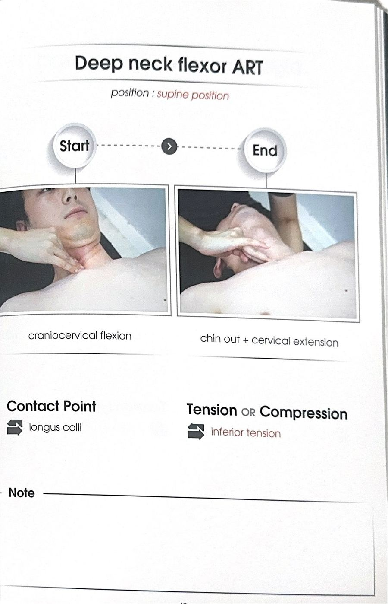

# 테크닉 20 | 심부경부굴곡근 / DNF (Deep Neck Flexors)

## 이 사람에게 해!
- 운동 중 턱이 자꾸 들리거나(턱을 당기지 못하는) 사람 — **해부학적 이유:** DNF는 상부경추 굴곡(턱 당기기)을 유일하게 만들어낼 수 있는 근육군이다. 다른 목 굴곡 근육(SCM, 사각근)은 하부경추만 굴곡시킬 수 있어 상부경추 굴곡을 대신하지 못한다.
- 교통사고(추돌사고) 병력이 있는 사람 — **강사 판단(1급 정보):** 사고 순간 몸은 고정되고 머리만 채찍질처럼 젖혀지면서 DNF가 찢어지는 손상이 매우 흔하다고 한다. 사고 직후 반사적으로 뒷목을 손으로 잡는 행동은, 원래 신전을 막아주는 DNF가 손상돼 그 역할을 손으로 대신하려는 반응이라는 강사 해석.
- 목 통증 재활이 필요한 사람 전반 — DNF는 약화·저활성이 매우 흔한 근육이며, 재활 트레이닝에서 목 파트의 핵심 근육으로 강조됐다("별표 치시고 목에서 제일 중요해요").

## 핵심 한 줄
DNF(전두직근·외측두직근·두장근·경장근 4개를 합친 이름)는 목 앞쪽 가장 안쪽(내재근)에 뼈에 바로 발려 있는 근육군으로, 상부경추 굴곡(턱 당기기)을 유일하게 담당하며 시상면에서 목이 뒤로 젖혀지지(신전) 않도록 버티는 안정자 역할을 한다.

## 짧아지는 자세 vs 늘어나는 자세
- **짧아지는 자세(정상 작동 시):** 턱을 당긴 자세(상부경추 굴곡)
- **늘어나는 자세(스트레스를 받는 자세):** 목이 뒤로 젖혀지는(신전) 자세, 특히 조절 없이 급격히 신전되는 경우(교통사고 채찍질 손상 기전)

## 촉진 (Palpation)
전사문에는 DNF에 대한 직접 촉진 방법(손가락으로 만져 확인하는 방식)은 확인되지 않는다 — 목 안쪽 깊은 곳에 위치해 촉진이 어려운 근육이며, 대신 아래의 패턴검사·근력평가로 기능을 확인한다.

## ART 1
전사문에는 DNF에 대한 클리닉형 ART나 MET(등척성수축) 시연은 확인되지 않는다. 확인되는 것은 아래의 ①패턴검사, ②근력평가(MMT), ③운동(파인 스트레치 응용·인버티드 로우 응용) 세 가지이며, 지어내지 않고 각각 정리한다.

### 검사 1 — 배꼽보기 굴곡패턴 검사
**자세:** 대상자 천장을 보고 누운 자세

**방법:**
① 검사자가 짧고 간결하게 "배꼽 보세요"라고만 지시한다 — **강사 큐잉(원표현):** "패턴 검사를 할 때는 설명을 많이 하지 않고 간결하게 이야기한다"고 강조하며, 구구절절 설명하면 움직임 패턴 자체가 바뀌어 버리기 때문이라고 이유를 밝혔다.
② 대상자가 스스로 머리를 들게 하고, 턱을 먼저 당기는 움직임이 나온 뒤 머리가 드는지, 아니면 턱 당김 없이 머리 전체가 통째로 들리는지를 관찰한다.
③ 1회 시행 후 반드시 힘을 다 빼고 처음 자세로 되돌아온 뒤 다시 시행한다 — 계속 힘이 들어간 채로는 패턴을 제대로 확인할 수 없다.

**해석:** 턱을 당기는 움직임 없이 머리 전체가 그냥 들리면 DNF(특히 상부경추 굴곡) 기능이 떨어졌다고 볼 수 있다.

### 검사 2 — DNF 도수근력검사 (MMT)
**자세:** 대상자 천장을 보고 누운 자세, 검사자가 대상자 머리 뒤에 손베개(깍지 끼지 않고 손 하나)를 대어 준다

**방법:**
① 손베개를 머리에 붙인 상태에서 턱을 당기게 해 상부경추 굴곡을 만든다.
② 검사자가 손을 뺀 뒤 그 자세(손베개 높이)를 그대로 버티게 한다.
③ 20~30초 버텨야 DNF에 문제가 없다고 판단한다 — 대부분 오래 버티지 못하며(약화·저활성이 매우 흔함), 이 경우 약화로 판단한다.
④ 잘 버티는 경우에는 근력 문제가 아니라 습관(턱 당기는 움직임을 평소에 잘 쓰지 않는 것)일 뿐이므로, "턱당기기 연습"만 추가로 안내한다.

**강사 판단(1급 정보):** 이 검사에서 잘 못 버티고 옛 교통사고 병력이 확인되면, DNF 손상 가능성을 의심하고 물어봐야 한다.

### 운동 1 — DNF 강화 (파인 스트레치 응용 / 인버티드 로우 응용)
**자세 1 (파인 스트레치 응용):** 무릎을 꿇고 앉아 키가 커지도록 앉은 뒤, 손을 앞으로 나란히 뻗는다. 머리 뒤쪽(후두부)을 전완 위에 얹고, 뒷목이 길어지는 느낌으로 살짝 눕는다.

**방법:**
① 턱을 가볍게 당긴 상태에서 살짝 들어올린다.
② 검사자(또는 스스로)가 받쳐주던 손(팔)을 뗀 뒤 그 자세를 버틴다 — 머리 무게 때문에 목이 뒤로 젖혀지려는 힘에 저항하는 것이 핵심(안티 익스텐션 운동).

**자세 2 (인버티드 로우 응용):** 다리를 잡고 뒤로 누워, 뒤통수부터 다리까지 일자가 되도록 만든다.

**방법:**
① 손을 가볍게 당겨 몸을 세우는 동안, 목은 안티 익스텐션(신전되지 않게) 상태로 고정한다.
② 로우(당기기)를 하듯 천천히 당겼다 돌아오기를 반복한다 — 겉보기엔 등 운동처럼 보이지만 실제로는 목(DNF)을 세팅한 상태로 유지하는 목 운동이다.

**구두 지시:** "배꼽 보세요." / "손베개 높이만큼만 유지하고 버텨보세요."

**재검사 확인:** 전사문에는 이 운동 직후의 즉각적 재검사 절차는 별도로 확인되지 않으나, 위 검사 1(배꼽보기)·검사 2(MMT)를 반복 시행해 패턴·근력 변화를 비교하는 방식이 함께 안내됐다.

## F3 참고 이미지 (소책자)
소책자 실측 확인(2026-07-19, `테크닉 소책자.pdf` 스캔본 물리 40페이지 기준). 아래는 해당 물리 페이지를 좌/우 절반으로 크롭한 이미지 — 사진 박스 안 손 위치·압력 방향과 함께 Contact Point/Tension·Compression(또는 Barrier/Resistance) 필드도 그대로 보인다.

## 임상 포인트
| 포인트 | 내용 |
|---|---|
| 유일한 상부경추 굴곡 근육 | SCM과 사각근도 굴곡을 만들지만 둘 다 하부경추 굴곡만 가능하다 — 상부경추 굴곡(턱 당기기)은 DNF만 할 수 있다 |
| 협력근 우세 관계 | DNF가 약화되면 상부경추 굴곡은 포기한 채 SCM·사각근을 동원해 하부경추 굴곡만으로 움직임을 만들어내는 협력근 우세가 매우 흔하다고 강사가 강조 |
| 시상면 안정자(안티 익스텐션) | DNF의 원래 역할은 목이 신전되지 않게 버티는 것 — 이 기능이 떨어지면 머리를 뒤로 젖히는 동작 자체를 부담스러워한다 |
| 교통사고와의 연관 | 채찍질 손상으로 DNF가 손상되면 목이 "너덜너덜"해지고, 사고 직후 반사적으로 뒷목을 손으로 잡는 행동이 나타난다는 강사 해석 — 옛 사고 병력을 반드시 확인해야 하는 이유 |
| 후두하근과의 길항 | 후두하근이 단축·뻣뻣해지면 DNF가 일을 잘 못하게 되고, 결국 SCM·사각근이 협력근으로 대신 작동하는 협력 분쇄까지 이어질 수 있다는 강사 설명 |
| ART/MET 시연 여부 | 원문 전사문에는 DNF에 대한 클리닉형 ART나 MET(등척성수축) 시연은 확인되지 않는다 — 확인된 것은 위 패턴검사·근력평가·운동 세 가지뿐이며, 지어내지 않고 미기재로 남긴다 |

## 금기 · 주의
- 패턴검사(배꼽보기) 시행 시 설명을 과하게 하지 않는다 — 설명이 많으면 대상자의 자연스러운 움직임 패턴 자체가 바뀌어 정확한 관찰이 어렵다.
- 근력평가·운동 모두 1회 시행 후 완전히 힘을 빼고 처음 자세로 돌아온 뒤 다시 시행해야 한다 — 힘이 남은 채로는 패턴이 왜곡된다.
- 옛 교통사고(추돌사고) 병력이 있는 대상자는 DNF 손상 가능성을 반드시 확인한다.

## 한 줄 정리
> "턱을 당기는 힘이 있는지 배꼽보기 패턴검사와 손베개 30초 버티기로 확인하고, 파인 스트레치·인버티드 로우 응용으로 안티 익스텐션 근력을 키운다."

## 체인 링크
- **의심근육→** 후두하근(길항 관계, 후두하근 단축 시 DNF 기능 저하) · 흉쇄유돌근·사각근(DNF 약화 시 협력근 우세로 대신 하부경추 굴곡을 담당)
- **테크닉→** 미기재
- **재검사→** DNF 근력검사(assessment-21) — 본 카드의 "검사 2 — DNF 도수근력검사(MMT)"가 해당 재검사와 동일한 절차로 추정된다

<!-- ok -->
