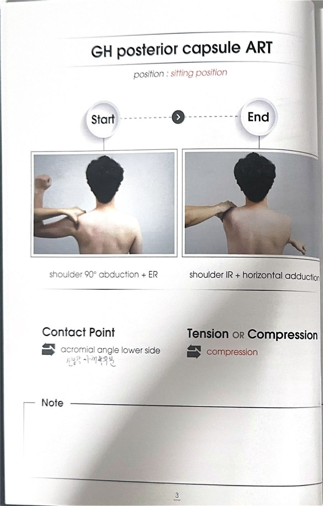

# 테크닉 11 | GH 후방 관절낭 / 뒤쪽 관절주머니 / GH Posterior Capsule

## 이 사람에게 해!
- 내회전 검사 제한이 있는 사람
- 오십견 — 전방보다 후방 관절낭이 뻣뻣한 경우가 훨씬 흔하다
- 어깨 전방 활주 문제가 있는 사람(후방이 너무 뻣뻣해서 상완골 머리가 전방으로 밀려 나오는 경우)

## 핵심 한 줄
후방 관절낭이 뻣뻣해지는 게 전방보다 훨씬 흔하다. 내회전 제한이 있으면 가장 먼저 확인하는 부위이며, 소책자 3페이지는 이 후방 관절낭 자체(가장 안쪽), 3~5페이지 전체는 "내회전 개선"이라는 하나의 목적으로 묶여 있다.

## 짧아지는 자세 vs 늘어나는 자세
- **짧아지는 자세 / 선서자세:** 팔을 앞으로 90도 든 자세 (선서하듯이)
- **늘어나는 자세:** 선서자세에서 내회전 + 반대팔로 팔 끌어당기기

## 촉진 (Palpation)
**접촉 위치:** 어깨뼈 가시를 따라 끝까지 가면 견봉이 나온다. 견봉각 아래쪽 공간 — 거기를 누르면 쑥쑥 들어가는 공간이 견갑골과 상완골의 경계선이다. 이 부위는 가장 안쪽에 있는 후방 관절낭 자체를 다루는 지점이며, 여기가 풀리면 더 바깥쪽에 있는 극하근·소원근·후면삼각근까지 함께 풀리는 효과가 있다.

## ART 1
**자세:** 대상자 앉은 자세 / 검사자 대상자 측방

**방법:**
① 선서자세 (어깨 90도 굴곡) 에서 시작.
② 검사자는 견봉각 아래쪽 공간에 손가락을 대고 지그시 압박.
③ 대상자에게 내회전을 가볍게 만들면서 반대팔로 팔을 끌어당기도록 안내.
④ 팔이 내회전되면서 밖으로(옆으로) 빠질 때 검사자도 같이 따라가며 압박을 지속 유지한다 — 압박을 유지한 채 대상자의 움직임을 따라가는 것이 핵심이며, 시큰한 느낌이 나면 제대로 들어간 것이다.
⑤ 돌아올 때는 힘을 빼도 된다.
⑥ 3회 반복.

**셀프 방법 (폼롤러):** 딱딱한 폼롤러(말랑한 것도 가능하나 딱딱한 것 추천) 사용. ① 팔 뒤로 넣고 폼롤러에 견봉각 아래(촉진 지점)가 닿게 눕는다. ② 머리는 살짝 맞춰주고 반대팔로 팔을 잡고 당긴다. ③ 그 상태에서 등을 말았다가 풀었다가 반복하며 후방 공간을 확장시킨다. ④ 또는 제일 아팠던 포인트를 꽉 눌러놓고 팔을 쭉 당겼다 풀었다 반복하는 방식으로도 확장시킬 수 있다. ⑤ 서서 벽에 등을 대고도 가능하다 — 이때는 어깨가 너무 많이 튀어나오지 않을 정도로만 눌러서 막아준다.

**구두 지시:** "반대팔로 이 팔을 천천히 당겨보세요."

## MET 1
**자세:** 대상자 누운 자세, 내회전 끝범위 / 검사자 어깨 전면부를 가볍게 고정

**시작 자세:** 내회전 끝범위(가장 늘어난 위치)

**방법:**
① 대상자 팔을 내회전 끝범위에 위치시킨다.
② 검사자는 어깨 전면부를 가볍게 고정한다(돌아오는 힘이면 위쪽에, 더 가는 힘이면 아래쪽에 벽을 만든다는 느낌으로 손 위치를 정한다).

**큐잉 1 — PIR (돌아오는 힘):** "외회전하려는 힘 주세요." → 내회전 끝범위에서 되돌아 나오려는(외회전 방향) 등척성 수축

**큐잉 2 — RI (더 가는 힘):** "더 내회전하려는 힘 주세요." → 이미 끝범위인 내회전을 더 깊게 밀어붙이려는 힘

③ 숨 마시고 → 숨 참고 → 약 20~30% 강도로 7초 유지 → 후~ 내쉬면서 힘 빼기.
④ 힘 빼는 순간 검사자가 어깨를 살짝 더 눌러 내회전 방향으로 가볍게 스트레칭을 돕는다.
⑤ 2~3회 반복. 양쪽 다 적용해볼 수 있으나, 대상자가 더 편하게 느끼는 쪽(대개 PIR — 돌아오는 힘)을 우선한다.

**포인트:** 신경·조직에 실제 문제(수술 이력 등)가 있는 대상자는 RI(더 가는 힘)에서 통증을 호소할 수 있으므로 이런 경우 PIR(돌아오는 힘)만 적용한다 / 단순히 긴장도가 높아져 있는 정도라면 둘 다 시도해보고 편한 쪽으로 선택해도 무방 / 힘을 잘 못 빼는 대상자에게는 "괄약근(항문)에 힘을 빼라"는 큐잉이 효과적 — 몸 전체 긴장이 함께 빠진다 / 한쪽에 테크닉을 적용해도 반대쪽 가동성이 함께 개선되는 경우가 있는데, 이는 조직이 물리적으로 풀린 게 아니라 감각·운동 정보가 신경계를 통해 양측으로 전달되기 때문이다

## F3 참고 이미지 (소책자)
소책자 실측 확인(2026-07-19, `테크닉 소책자.pdf` 스캔본 물리 3페이지 기준). 아래는 해당 물리 페이지를 좌/우 절반으로 크롭한 이미지 — 사진 박스 안 손 위치·압력 방향과 함께 Contact Point/Tension·Compression(또는 Barrier/Resistance) 필드도 그대로 보인다.

이전 기록 '3~5페이지'는 부정확했음 — 실측 결과 GH posterior capsule ART는 물리 3페이지에만 있음(4~5페이지는 별도 기법인 Infraspinatus & Teres minor).

## 임상 포인트
| 포인트 | 내용 |
|---|---|
| 후방 vs 전방 | 후방 관절낭이 전방보다 훨씬 흔하게 뻣뻣해짐 — 내회전 제한 시 우선 의심 |
| 전방 활주 | 후방이 과도하게 뻣뻣하면 상완골 머리가 전방으로 밀려나가는 전방 활주 문제로 이어질 수 있음 |
| 양측 개선 현상 | 한쪽 테크닉 적용 후 반대쪽도 함께 좋아지는 경우가 있음 — 조직이 풀린 게 아니라 신경계 피드백이 양측에 전달되는 효과 |
| 강도 | 매우 약한 힘(20~30%)으로도 충분 — 술자가 힘으로 이겨내려 하지 않는다 |

## 금기 · 주의
- 어깨 수술 이력 등 조직 손상이 있는 대상자는 RI(더 가는 힘)에서 통증이 유발될 수 있으므로 PIR 위주로 적용한다.
- MET 시 목이 아니라 어깨 전면부를 정확히 고정한다 — 관절이 실제로 움직이면 등척성 수축이 성립하지 않는다.

## 한 줄 정리
> "내회전 안 되면 8할은 후방 관절낭 — 견봉각 아래 꾹 눌러 반대팔로 당기는 ART, 끝범위에서 돌아올래 더 갈래 MET"

## 체인 링크
- **의심근육→** 극하근·소원근(후방 관절낭을 풀면 함께 이완되는 더 바깥쪽 조직들, 원문: "얘네들이 좀 더 밖에 있으니까") — [[테크닉_극하근]]·[[테크닉_소원근]] · 후면삼각근(카드없음)
- **테크닉→** 미기재 (원문에 다른 테크닉과의 방법 동일성 언급 없음)
- **재검사→** 내회전 검사 — 검사_전체정리.md 검사 06

<!-- ok -->
