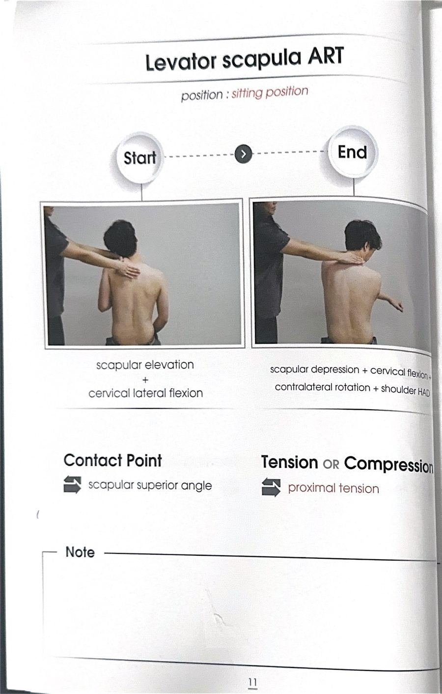
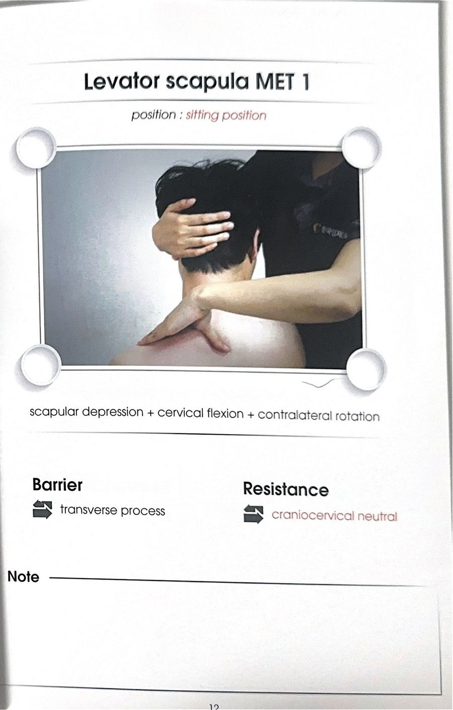
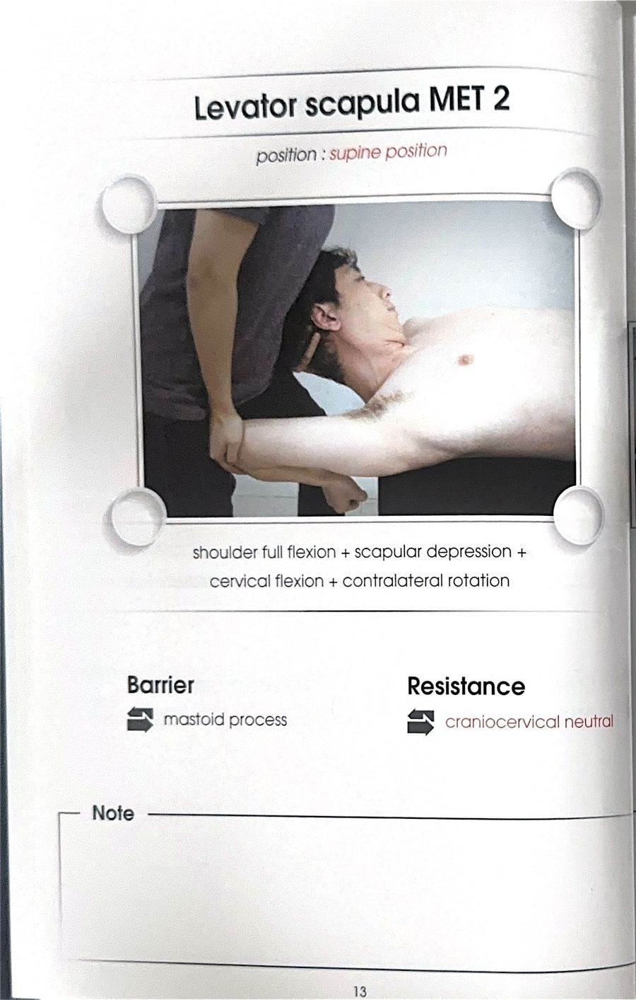

# 테크닉 03 | 견갑거근 / 어깨올림근 / Levator Scapulae

## 이 사람에게 해!
- 상방회전 검사 제한 시(하각이 몸통 끝까지 안 나오는 사람) — 견갑거근은 상방회전을 방해하는 근육이므로 상방회전 제한 시 실시한다.
- 평상시 상부승모근 쪽으로 통증·뻐근함("어깨가 묵직하다")을 호소하는 사람
- **플랫한(등이 편평한) 체형인 사람 — 특히 효과적.** 강사 개인 판단 근거: 등이 많이 펴지면 원래 굽어 있던 견갑골이 펴지면서 견갑골이 아래로 떨어지려는 힘이 더 커지고, 팔·어깨에 대한 중력 부담과 근육 요구도가 늘어 더 불편해진다.
- 목이 아프다고 호소하는 사람 — 견갑거근이 목 옆(경추 횡돌기)에 부착되어 있어 뻣뻣해지면 목을 잡아당겨 목 안의 압력이 올라간다. 목을 젖히거나 회전할 때 그쪽 어깨·목이 아프다고 하는 경우.

## 핵심 한 줄
견갑거근은 견갑골 상각을 목 쪽으로 끌어올리는 근육(견갑골 상각~경추 횡돌기). 단축·뻣뻣해지면 견갑골이 올라가거나 상방회전이 막히고, 목까지 잡아당겨 통증을 만든다.

## 짧아지는 자세 vs 늘어나는 자세
- **짧아지는 자세:** 어깨(귀)와 어깨가 가까워지게 어깨를 으쓱 올린 자세
- **늘어나는 자세:** 어깨를 내리고 머리를 반대편 골반 쪽으로 돌려 보내는 자세 (목과 상각 사이가 최대로 멀어지는 자세)

## 촉진 (Palpation)
**손의 접촉:** 상각을 먼저 찾는다 — 어깨뼈 가시를 따라가다 루트(견갑극 뿌리)에서 약 1cm 위로 올라간 지점을 80% 정도 등반하듯 짚은 뒤, 아래쪽으로 살짝 눌러서 상각 위치를 확정한다(원문 표현: "위 살짝 내리면 상각이 있다"). 삼각(상각) 부위를 가볍게 압박하면 두피 쪽까지 뻐근하게 당기는 느낌이 난다.

## ART 1
**자세:** 대상자 앉은 자세 / 검사자 대상자 후방 또는 측방

**방법:**
① 짧아진 자세 — 어깨(귀엽게)를 살짝 올려 귀와 어깨가 가까워진 상태에서 시작한다.
② 검사자는 상각(견갑거근 부착부) 쪽을 손가락으로 가볍게 압박·접촉한다.
③ 대상자에게 어깨를 먼저 내리게 하고, 이어서 머리를 반대편 골반을 보듯 돌리면서 동시에 반대 손으로 손목을 당겨(견갑거근을 더 늘림) 최대로 늘어난 자세로 보낸다.
④ 팔이 내려가고 머리가 반대로 가는 동안 검사자는 압박을 유지하거나 주변을 살짝 쓸어준다.
⑤ 3회 반복한다.

**구두 지시:** "어깨 먼저 내리시고, 반대편 골반을 보면서 반대손으로 손목을 당겨주세요."

**포인트:** 순서가 중요하다 — ① 어깨 먼저 내리기 → ② 머리를 반대편 골반 보며 손목 당기기, 두 단계를 나눠서 진행한다.

## MET 1
**자세:** 대상자 앉은 자세(강사는 의자에 앉아서 하는 것을 추천) / 검사자 대상자 후방 또는 측방

**시작 자세:** ART 끝범위보다 더 늘어난 자세 — 대상자 팔을 들어 올려(상방회전) 상각을 더 아래로 떨어뜨린 상태(팔을 들면 상방회전 되면서 상각이 더 내려가는 원리를 이용). 대상자가 팔을 계속 들고 있기 힘드므로 검사자가 대상자 앞에서 뒤로 손을 넣어 팔꿈치를 받쳐준다.

**방법:**
① 대상자 팔을 든 상태에서, 검사자가 앞에서 뒤로 손을 넣어 대상자 팔꿈치를 받쳐준다.
② 다른 손바닥으로 상각을 확실하게 눌러 내린 상태를 만든다.
③ 머리는 반대편 골반을 보고 있는 상태 — 이때 뒤통수가 검사자 손(벽)에 닿는다.

**큐잉 1 — PIR (돌아오는 힘):** "머리를 원래 위치로 돌아오려고 하는 힘 주세요." → 뒤로 신전, 옆으로 측굴, 반대로 회전하려는 복합적인 힘

④ 숨 마시고 → 참고 → 7초 유지 → 후~ 내쉬며 힘 빼기
⑤ 힘 빼는 순간 검사자는 머리 방향과 어깨 방향 모두를 살짝 더 늘려 스트레치
⑥ 2~3회 반복

**포인트:** 머리는 누르지 않는다 — 머리가 돌아오려는 힘(신전+측굴+회전 복합)만 받아준다 / 팔 든 채로 하는 것과 그냥 맨 자세로 하는 것은 효과 차이가 크다 — 팔을 들어놓고 하는 것을 권장 / 재검사는 팔 들었을 때 편해졌는지로 확인

## F3 참고 이미지 (소책자)
소책자 실측 확인(2026-07-19, `테크닉 소책자.pdf` 스캔본 물리 11~13페이지 기준). 아래는 해당 물리 페이지를 좌/우 절반으로 크롭한 이미지 — 사진 박스 안 손 위치·압력 방향과 함께 Contact Point/Tension·Compression(또는 Barrier/Resistance) 필드도 그대로 보인다.

## 임상 포인트
| 포인트 | 내용 |
|---|---|
| 플랫 체형 | 등이 펴지면 견갑골이 떨어지려는 힘이 커져 견갑거근·목 부담 증가 — 표준 체형보다 플랫한 사람에게 더 효과적 |
| 목 통증 연결 | 견갑거근이 목 옆(경추 횡돌기)에 부착 → 목 압력 상승 → 목 젖힘·회전 시 통증. 목 아픈 사람도 함께 적용 |
| 원인 | 상부승모근이 일을 잘 안 하면 견갑거근이 견갑골 고정 일을 대신 떠맡아 뻣뻣해지는 경우가 많음 |
| MET 방향 | 신전+측굴+동측회전이 복합된 "원래 위치로 돌아오려는 힘" — 한 방향만 미는 것이 아님 |
| 연결 운동 | 상부승모근 운동(어깨 최대로 으쓱 유지 → 유지한 채 팔을 천천히 옆으로 떨구기, 스캡션 방향으로) — 견갑거근이 뻣뻣해지는 이유가 상부승모근 저활성이므로 함께 훈련 |

## 금기 · 주의
- 원문에 별도 금기 문구 없음(미기재)

## 셀프케어 대체
- **엎드려/서서:** 피넛볼을 삼각(상각) 쪽에 대고 벽에 기대거나 서서, 머리를 살짝 고정한 채 팔만 위아래로 올렸다 내렸다 반복.
- **누워서:** 대상자가 누운 상태로 머리를 살짝 들어 회전을 만들어 고정한 뒤 딱 그 자세를 유지하며 팔을 들었다 내렸다 반복.
- **강도 높은 버전(헬스장):** 스미스머신 바벨에 어깨를 걸어 고정하고 머리도 고정한 뒤 팔을 당겨 스트레칭 — 상부승모근과 함께 강하게 자극 가능.
- **셀프 MET:** 어깨를 눌러 고정한 채 팔을 들어 늘린 자세를 만든 뒤, 숨 마시고 참으며 머리를 제자리로 돌아오려는 힘을 스스로 준다.

## 한 줄 정리
> "귀-어깨 가까이(짧은 자세) → 어깨 먼저 내리고 반대편 골반 보며 손목 당기기 → 팔 들어 상각 더 내린 자세에서 머리 원위치 힘 MET"

## 체인 링크
- **의심근육→** [상부승모근(저활성 시 견갑거근이 대신 일해서 과긴장)]
- **테크닉→** 미기재
- **재검사→** [업 스크래치 테스트, 상방회전 검사]
- **연관검사→** [상방회전 검사]

<!-- ok -->
