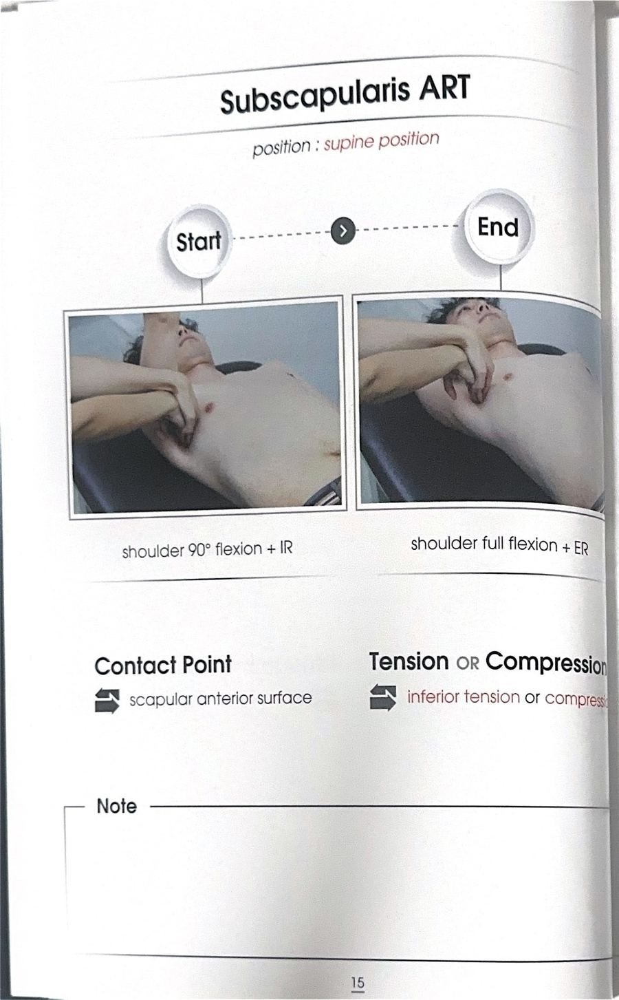
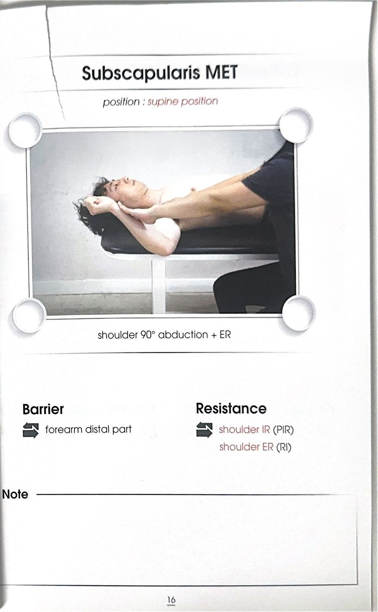

# 테크닉 06 | 견갑하근 / 어깨밑근 / Subscapularis

## 이 사람에게 해!
- 외회전 검사에서 제한이 나온 사람
- 오십견으로 회전 동작이 버거운 사람
- 리프트오프 검사에서 한쪽 힘이 덜 들어가는 사람 — 여성 고객처럼 외회전 제한이 뚜렷하지 않아 어느 쪽부터 다뤄야 할지 애매할 때, 리프트오프 검사 결과로 우선 적용 쪽을 정한다
- 회전근개 운동 전 가볍게 예열 자극이 필요한 사람 — 회전근개 기능 저하 대상자에게 운동 전 ART/MET를 가볍게 넣으면 효과적이다

## 핵심 한 줄
견갑하근은 내회전(IR) 주동근이며, 소결절(작은결절)에 부착되어 상완골두가 앞쪽으로 빠져나가지 않도록 혼자 버티는 근육이다. 대상자들은 보통 외회전 운동은 많이 해도 내회전 운동은 잘 하지 않기 때문에, 오히려 내회전 운동을 더 정교하게 챙겨줘야 하는 근육이다.

**해부학적 이유:** 소결절에 홀로 부착돼 골두 앞쪽을 지지하고, 뒤쪽에는 극하근·소원근이 부착되어 있다 — 앞쪽에 혼자 있어 평소 스트레스를 많이 받는 근육이라 촉진하면 의외로 굉장히 아픈 경우가 많다.

## 짧아지는 자세 vs 늘어나는 자세
- **짧아지는 자세 / 내회전 자세:** 앞으로 나란히 자세에서 팔을 안쪽으로 말아 둔 자세
- **늘어나는 자세 / 외회전 자세:** 그 팔을 만세하듯 위로 올리면서 점점 열어 주는 자세. 손은 올라가면서 엄지가 귀 쪽을 향하는 **따봉 자세**로 생각하면 방향이 잘 잡힌다

## 촉진 (Palpation)
**대상자 자세:** 누운 자세, 팔 옆으로 90도 벌림

**손의 접촉:** 겨드랑이 바로 아래에서 시작한다. 엄지손가락 있는 쪽(견갑골 외측 모서리 방향)에서 손을 사선으로 집어넣는다. 갈비뼈를 타고 붙여 들어가는 느낌으로 — 찌르듯 넣지 않는다. 손끝으로 딱딱한 견갑골 가장자리가 만져지면 촉진 성공이다.

**포인트:** 견갑골이 전방경사되어 있으면 팔을 약간 더 들어야 손이 더 잘 들어간다 / 팔이 올라갈수록(외회전이 진행될수록) 견갑골이 상방회전되며 촉진이 더 잘 된다 / 굉장히 아픈 부위이므로 살살, 지그시 접근한다.

## ART 1
**자세:** 대상자 누운 자세, 팔을 앞으로 나란히 + 내회전 자세로 시작 / 검사자 대상자 옆, 겨드랑이 안쪽으로 손을 사선으로 넣은 상태

**방법:**
① 대상자 팔을 앞으로 나란히 자세에서 내회전(짧아진 자세)으로 시작한다.
② 검사자는 겨드랑이 아래에서 견갑골 외측 모서리 안쪽으로 손을 사선으로 집어넣는다.
③ 손끝에 견갑골 가장자리가 느껴지면 그 위치에서 지그시 압박한다.
④ 대상자에게 팔을 만세하듯 위로 올리면서 엄지가 귀 쪽을 향하도록(따봉 방향) 안내한다.
⑤ 팔이 올라가는 동안 검사자는 압박을 유지한다.
⑥ 팔이 올라갈수록 촉진이 더 잘 된다. 견갑골이 보이면 안쪽 모서리를 살짝 당겨주듯 텐션을 더해도 좋다.
⑦ 3회 반복한다.

**구두 지시:** "팔을 만세하듯 올리면서, 엄지가 귀 쪽을 향하게 해보세요."

## MET 1
**자세:** 대상자 누운 자세, 팔을 외회전 끝범위에 둔 상태 / 검사자 어깨 앞쪽을 가볍게 고정

**시작 자세:** ART 끝범위 = 외회전 최대로 열린 자세

**방법:**
① 대상자 팔을 외회전 끝범위에 위치시킨다.
② 검사자는 어깨 전면부를 가볍게 고정한다.
③ 힘 방향을 정확하게 설명한다.

**큐잉 1 — PIR(자가억제기법, 돌아오는 힘):** "원래 자리로 돌아오려는 힘 주세요(안쪽으로 돌아오는 힘)."
**큐잉 2 — RI(상호억제기법, 더 가는 힘):** "조금 더 열리려는 힘 주세요(바깥으로 더 열리려는 힘)." → "돌아올래, 더 갈래"로 설명하면 대상자가 이해하기 쉽다.

**해부학적 이유:** PIR은 목표 근육(견갑하근) 스스로를 등척성 수축시켜 이완을 유도하는 자가억제기법이고, RI는 반대 방향 근육(외회전근)을 수축시켜 뇌가 견갑하근 쪽 방해 신호를 상호적으로 이완시키게 만드는 상호억제기법이다. 두 방향을 번갈아 쓰면 이완 효과가 배가된다.

④ 숨 참고 → 7초 유지(2,2,3,4,5,6,7,8,9,10과 같이 소리 내어 세면 대상자가 버티기 쉽다) → 후~ 내쉬며 힘 빼기
⑤ 2~3회 반복

**포인트:** "제 손을 미세요"처럼 말하면 팔 전체로 밀어버리기 쉬움 → 회전하는 힘이라고 정확히 설명한다. "이렇게 돌아오는 힘이에요, 아니면 더 가는 힘이에요?"처럼 방향을 벽(기준)으로 정확히 안내해야 한다. 어깨가 아프면 팔꿈치 밑에 받침을 넣어 스캡션 위치에서 진행 → 관절 부담이 훨씬 줄어든다. 부담이 큰 사람은 돌아오는 힘(PIR)부터 시작한다.

## F3 참고 이미지 (소책자)
소책자 실측 확인(2026-07-19, `테크닉 소책자.pdf` 스캔본 물리 15~16페이지 기준). 아래는 해당 물리 페이지를 좌/우 절반으로 크롭한 이미지 — 사진 박스 안 손 위치·압력 방향과 함께 Contact Point/Tension·Compression(또는 Barrier/Resistance) 필드도 그대로 보인다.

## 임상 포인트
| 포인트 | 내용 |
|---|---|
| 손 방향 | 사선으로 넣기 — 찌르듯 넣으면 안 됨 |
| 아픔 | 굉장히 아픈 부위 → 지그시, 살살 |
| 오십견 | 강하게 풀기보다 회전이 덜 버겁게 만드는 방향으로 소프트하게 |
| 스캡션 | 어깨 아프면 팔꿈치 밑 받침 후 스캡션 위치에서 MET |
| 내회전 운동 우선 | 대상자는 보통 외회전 운동만 하고 내회전은 안 함 → 내회전 운동을 더 정교하게 해줘야 함 |
| 치료 측 결정 | 외회전 제한이 뚜렷하지 않을 때(주로 여성 고객)는 리프트오프 검사(또는 누운 자세 팔 낙하 비교)로 좌우 근력차를 확인해 약한 쪽부터 우선 적용 |
| 유사 테크닉 | 첫 수업에서 다룬 "내회전 제한자에게 하는 돌아올래·더갈래" MET와 방향만 반대일 뿐 원리는 거의 동일 |

## 금기 · 주의
- 굉장히 아픈 부위 → 세게 찌르지 말고 살살, 지그시 접근
- 오십견 대상자는 소프트하게
- MET 시 어깨 통증 있으면 팔꿈치 받침 + 스캡션 위치로 부담 완화
- MET 힘 방향 설명이 부정확하면 대상자가 팔 전체로 밀어버려 통증을 유발할 수 있음 — 회전 방향을 정확히 안내할 것

## 한 줄 정리
> "앞으로 나란히 내회전 → 만세 따봉 방향 → 겨드랑이 사선으로 지그시 → MET는 돌아올래 더 갈래(PIR/RI)"

## 체인 링크
- **의심근육→** 미기재
- **테크닉→** GH 전방 관절낭(같은 수업 흐름에서 외회전 제한 근육으로 이어서 다룸)
- **재검사→** 외회전 검사 / 리프트오프 검사

<!-- ok -->
