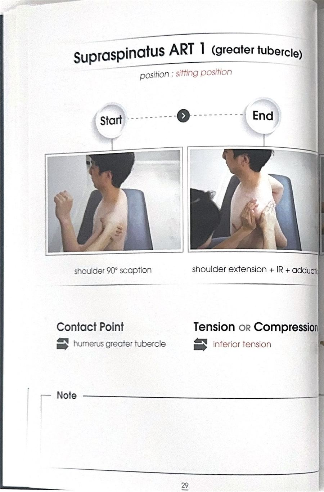
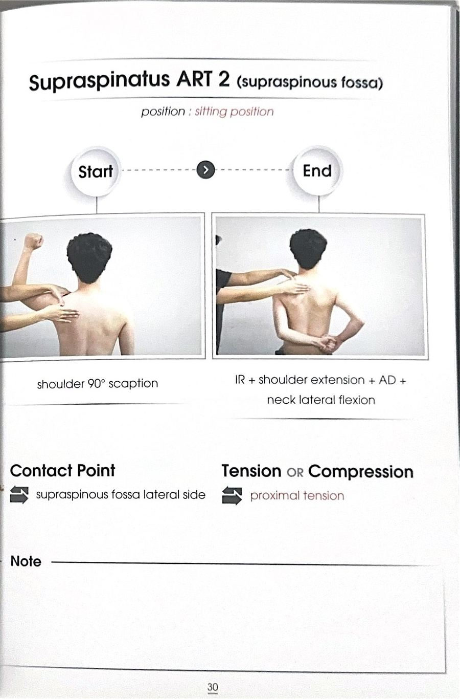
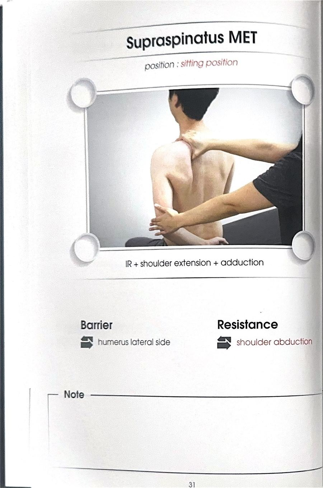

# 테크닉 12 | 극상근 / 가시위근 / Supraspinatus

## 이 사람에게 해!
- 다운 스크래치 제한 (29·30페이지 — 다운 스크래치 안될 때)
- 견갑골 하방회전이 의심되는 사람
- 팔 드는 동작이 불편한 사람
- **일상 신호:** 뒷짐 지기가 불편한 사람 / 겉옷·자켓을 뒤로 손 넣어 입기 어려운 사람 / 샤워 시 등을 긁거나 샤워볼로 등을 닦기 어려운 사람(특히 여성 — 긴 샤워볼을 쓰지 못하고 손바닥만한 것으로 억지로 닦는 경우) / 차에서 조수석·운전석에서 뒷좌석 물건을 집기 위해 팔을 뒤로 뻗기 어려운 사람 — 남성은 유연성이 더 떨어져 흔히 나타난다

## 핵심 한 줄
극상근 + 삼각근(별도 카드 없음 — 극상근 카드에서 함께 다룸)은 견갑골이 하방회전되면 짧아진 위치에 놓인다. 원래 하방회전 자체는 정상적으로 가능한 움직임이지만, 어깨가 불안정해지면 팔이 가만히 있는 상태에서도 견갑골이 하방회전 위치로 자꾸 돌아가 있게 되고, 그 결과 극상근·삼각근이 짧은 위치에 고정되어 뻣뻣해진다. 여기를 해결하면 견갑골이 다시 잘 움직이게 되어 팔 드는 것이 편해진다.

## 짧아지는 자세 vs 늘어나는 자세
- **짧아지는 자세 / 선서 스캡션 자세:** 팔을 앞으로 들고 스캡션 위치
- **늘어나는 자세 / 다운 스크래치 자세:** 팔을 등 뒤로 넣어 허리 쪽으로 집어넣는 자세

## 촉진 (Palpation)
원문에 별도 촉진(Palpation) 섹션 없음(미기재). ART 접촉 위치가 각 ART 항목에 개별 기술됨.

## ART 1 — 대결절 / 삼각근·이두근과 함께 (29페이지)
**자세:** 대상자 앉은 자세 / 검사자 대상자 전방

**접촉 위치:** 어깨 전면부 (동그란 어깨 앞쪽에서 가슴과의 경계선) — 엄지손가락 사용. 정지점(대결절)에 적용하는 테크닉이지만 실제로는 어깨 전면부 전체를 다루며, 삼각근·이두근까지 함께 살펴보는 테크닉이다.

**방법:**
① 선서 스캡션 자세에서 시작.
② 검사자는 어깨 전면부(동그란 어깨~가슴 경계선)를 엄지로 잡는다.
③ 대상자에게 뒷짐을 지듯 천천히 다운 스크래치 자세로 팔을 보내도록 안내한다.
④ 반대팔로 당기면서 보조한다.
⑤ 팔이 가는 동안 검사자는 어깨 전면부에서 옆쪽(바깥쪽)으로 쓸어준다.
⑥ 3회 반복.

**주의:** 어깨 전면부에는 이두근 장두 힘줄이 지나가는 이두근 구가 있다 — 여기를 세게 문지르면 힘줄이 탁탁 튕기면서 불편함·통증을 유발한다. 엄지 면 전체를 살려서 체중을 실어 가볍게 쓸어준다. 맨살에 하는 것을 추천한다(옷 위에 하면 살이 쓸려서 오히려 아프고 효과도 떨어진다).

**구두 지시:** "반대 팔로 이 팔을 뒤로 천천히 당겨보세요." / "앞에서 뒤쪽으로 가볍게 쓸어주세요."

## ART 2 — 극상와 / 상부승모근과 함께 (30페이지)
**접촉 위치:** 어깨뼈 가시 위쪽(극상와, 극상근의 기시점) — 승모근에 덮여 있는 상태에서 그 위를 눌러 쓸어준다. 가시 바깥쪽부터 시작해 가시를 따라 안쪽으로 쓸어준다.

**방법:**
① ART 1과 동일한 시작 자세(선서 스캡션 자세).
② 검사자는 어깨뼈 가시 위쪽에 손을 대고, 다른 한 손으로 어깨를 가볍게 눌러 고정한다(밀 때 대상자가 넘어지지 않게 하기 위함).
③ 대상자는 다운 스크래치 자세로 이동한다.
④ 팔이 이동하는 동안 검사자는 가시 위쪽에서 안쪽 방향으로 쓸어준다.
⑤ **추가:** 팔을 당기기 시작하면서 머리를 반대편으로 가쪽 기울이기(넥 레터럴 플렉션) → 극상근은 머리 움직임에 관여하지 않으므로, 이 동작을 추가하면 상부승모근까지 함께 해결하는 효과가 있다.

**구두 지시:** "머리를 반대쪽으로 살짝 기울이면서 팔을 뒤로 당겨보세요."

## MET 1 (두 가지 방법)

**1) 앉아서 — 견갑골 고정, 팔만 밀어넣기**
- 다운 스크래치 끝범위에서
- 견갑골을 단단히 고정하고 팔만 안쪽으로 더 밀어넣는다
- 숨 참고 → 팔을 살짝 벌리는 힘(등척성) 주기 → 7초 → 힘 빼기
- 힘 빼면 견갑골을 고정한 채로 팔만 더 밀어넣는다

**2) 누워서 — 견갑골 전체 돌리기**
**자세:** 대상자 옆으로 누운 자세, 다운 스크래치(하방회전) 끝범위 / 검사자 대상자 뒤쪽에서 견갑골 안쪽으로 손을 넣고 전면부 막기

**시작 원리:** MET는 등척성 수축이므로 관절이 실제로 움직이지 않도록 확실히 벽(고정)을 만들어야 한다 — 방법 1)이 팔만 고정·이완하는 것과 달리, 여기서는 견갑골 자체를 통째로 고정한다는 점이 다르다.

**방법:**
① 대상자를 옆으로 눕히고, 하고자 하는 쪽 팔이 위로 오게 한 뒤 다운 스크래치(하방회전) 끝범위에 놓는다.
② 검사자는 손가락을 견갑골 내측 모서리 안쪽으로 밀어 넣어 견갑골을 고정하고, 어깨 전면부·팔꿈치 바깥쪽을 함께 막아 팔이 벌어지지 않도록 한다.
③ 대상자에게 "어깨를 으쓱 올리면서 팔을 벌리는 힘"을 주도록 지시한다 — 이 힘이 실제로 작동하면 상부승모근·전거근·하부승모근이 동원되어 견갑골이 상방회전 방향으로 돌아가려 하므로, 검사자는 이 상방회전을 막아 등척성 수축을 만든다.
④ 숨 참고 → 약 20% 강도로 7초 유지 → 후~ 내쉬면서 힘 빼기.
⑤ 힘 빼는 순간 검사자는 견갑골을 통째로 잡고 하방회전 방향으로 더 돌려 늘려준다(방법 1)이 팔만 미는 것과 달리, 여기서는 견갑골 자체를 돌린다).
⑥ 2~3회 반복.

**포인트:** 견갑골 내측 모서리가 몸통에서 뜨지 않도록(붙지 않도록) 손가락으로 확실히 고정하는 것이 등척성 수축 성립의 핵심 — 고정이 풀리면 견갑골이 움직여버려 등척성 수축이 되지 않는다 / 힘은 술자가 이기지 못할 정도로 약해도 충분하다(약 20% 강도) / 극상근·삼각근 모두 이 방법으로 함께 적용된다

## F3 참고 이미지 (소책자)
소책자 실측 확인(2026-07-19, `테크닉 소책자.pdf` 스캔본 물리 29~31페이지 기준). 아래는 해당 물리 페이지를 좌/우 절반으로 크롭한 이미지 — 사진 박스 안 손 위치·압력 방향과 함께 Contact Point/Tension·Compression(또는 Barrier/Resistance) 필드도 그대로 보인다.

## 임상 포인트
| 포인트 | 내용 |
|---|---|
| 일상 신호 | 뒷짐 지기, 겉옷 뒤로 손 넣기, 등 샤워, 차 뒷좌석 물건 집기 등에서 불편함 호소 |
| ART1 vs ART2 | ART1(29p)=삼각근·이두근 동반, ART2(30p)=상부승모근 동반(넥 레터럴 플렉션 추가) |
| MET 방법 선택 | 방법 1(팔만 밀어넣기)이 기본, 방법 2(견갑골 전체 돌리기)는 더 강한 자극이 필요할 때 |
| 하방회전 논리 | 어깨 불안정 시 견갑골이 하방회전 위치로 자꾸 돌아가 있어 극상근·삼각근이 짧은 위치에 고정 — 이를 풀면 팔 드는 기능이 개선 |

## 금기 · 주의
- 어깨 전면부(이두근 구)를 세게 문지르면 이두근 장두 힘줄이 튕기며 통증을 유발한다 — 엄지 면 전체로 가볍게 쓸어준다.
- 옷 위에서 시행하면 마찰로 통증이 발생하고 효과도 떨어진다 — 맨살 시행을 권장한다.

## 한 줄 정리
> "다운 스크래치 막히면 극상근·삼각근 의심 — 대결절에서 어깨 전면 쓸어주는 ART1, 극상와에서 상부승모근까지 잡는 ART2, 팔만 밀거나 견갑골째 돌리는 MET"

## 체인 링크
- **의심근육→** 상부승모근(ART2에서 함께 다룸) · 삼각근(카드 없음 — 극상근 카드에서 통합 서술)
- **테크닉→** 미기재
- **재검사→** 다운 스크래치 테스트 — 검사_전체정리.md 검사 02

<!-- ok -->
