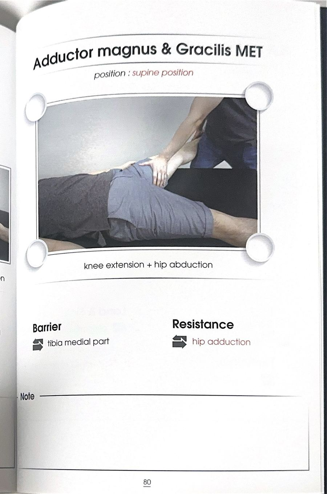

# 테크닉 46 | 대내전근 / 큰모음근 / Adductor Magnus

## 이 사람에게 해!
- SLR(무릎 펴서 다리 들기) 가동성이 제한된 사람 — **해부학적 이유:** 대내전근은 햄스트링(반건양근·반막양근)과 같은 좌골조면에서 시작해 나란히 내려가고, 서로 비벼지며 유착도 잘 생긴다("제2의 햄스트링"). 이 유착이 SLR 가동성을 제한하는 원인이 될 수 있다 — 즉 SLR 제한이 항상 햄스트링만의 문제는 아니라는 것이 강사의 포인트.
- 앉을 때 허벅지 안쪽 살이 밀려 들어오는 게 신경 쓰이는 사람 — 대내전근은 허벅지 내측의 부피 대부분을 차지하는 근육으로, 앉았을 때 밀려 들어오는 허벅지 안쪽 살의 대부분이 대내전근 자체의 부피다.
- 폼롤러로 허벅지 안쪽(내전근 결절 부위)을 눌렀을 때 유독 아팠던 사람 — 대내전근 촉진 지점(어덕터 투버클)은 원래 압통이 잘 느껴지는 부위로 설명됨.

## 핵심 한 줄
대내전근은 내전근 5형제 중 가장 크고 넓은 근육으로, 앞쪽 사선 섬유(치골 가지 하부→거친선)는 내전을 주동하고 뒤쪽 수직 섬유(좌골조면→내전근 결절, 어덕터 투버클)는 햄스트링처럼 고관절 신전에도 관여해 "제2의 햄스트링"으로 불린다 — 허벅지 내측 부피의 대부분을 차지하며 SLR 가동성을 제한할 수 있는 근육이다.

## 짧아지는 자세 vs 늘어나는 자세
- **짧아지는 자세:** 고관절 내전(사선 섬유) + 신전(수직 섬유, 다리가 몸통보다 앞에 있을 때는 오히려 굴곡 방향으로 기능이 바뀜 — 안테리어 내전근들과 마찬가지로 자세에 따라 굴곡·신전이 확확 바뀐다는 것이 강사의 설명).
- **늘어나는 자세:** 고관절 벌림(외전) + 굴곡(수직 섬유 기준). 세부 스트레칭 시연은 원문에 확인되지 않는다 — 지어내지 않고 이 정도만 남긴다.

## 촉진 (Palpation)
**어덕터 투버클(내전근 결절) 촉진:** 허벅지 안쪽에 손을 넣고 재봉선을 따라 가운데서부터 꾹 눌러 내려가면 뼈처럼 걸리는 지점이 있다(어덕터 투버클, 무릎 안쪽 가까이). 다리를 살짝 펴면 촉진이 더 잘 된다. 앞뒤로 끌어보면 통증이 느껴질 수 있는데, 원문에서는 "촉진하면 되게 아픈 곳"으로 설명되며 폼롤러로 문지르면 유독 아플 수 있는 부위다.

## 운동처방 (내전근 그룹 공통)
치골근·장내전근·단내전근과 함께 동일한 내전근 그룹 원칙이 적용된다 — 상세 프로토콜(코펜하겐 내전근 운동, 몸통 개입을 동반한 신장성 운동, CKC 선호 등)은 `테크닉_장내전근.md`의 "운동처방" 섹션과 동일하므로 그쪽을 참조. 여기서는 중복 기재하지 않는다.

## F3 참고 이미지 (소책자)
소책자 실측 확인(2026-07-19, `테크닉 소책자.pdf` 스캔본 물리 80페이지 기준). 아래는 해당 물리 페이지를 좌/우 절반으로 크롭한 이미지 — 사진 박스 안 손 위치·압력 방향과 함께 Contact Point/Tension·Compression(또는 Barrier/Resistance) 필드도 그대로 보인다.

소책자의 대내전근 단독 ART(물리 72페이지)는 이번 스캔 원본에 해당 스프레드 사진이 없어(촬영 누락 추정) 확보하지 못함 — 확보된 것은 박근과 통합된 MET(80페이지)뿐이며 박근 카드와 이미지 공유.

## 임상 포인트
| 포인트 | 내용 |
|---|---|
| 사선 섬유 vs 수직 섬유 | 사선 섬유(앞): 치골 가지 아래쪽~거친선, 내전 주동 / 수직 섬유(뒤): 좌골조면~어덕터 투버클, 햄스트링과 나란히 내려가며 신전에도 관여("제2의 햄스트링") |
| 제2의 햄스트링 | 좌골조면에서 함께 시작해 햄스트링(특히 반건양근·반막양근)과 유착이 잘 생기는 위치 관계 — SLR 가동성 제한의 원인이 햄스트링만이 아니라 대내전근일 수도 있다는 것이 핵심 포인트 |
| 허벅지 내측 부피의 주범 | "앉을 때 허벅지 안쪽 살 쫙 밀려 들어오면 대부분 대내전근" — 허벅지 내측 부피 대부분을 차지하는 크고 넓은 근육 |
| 기능 전환(굴곡↔신전) | 다리가 몸통보다 앞에 있으면 굴곡근처럼, 뒤에 있으면 신전근처럼 기능이 바뀐다 — 달리기 동작을 예로 들어 설명(안테리어 내전근들과 같은 원리) |
| MET/ART 시연 여부 | 원문 전사에는 대내전근에 대한 개별 수기 ART/MET 시연이 확인되지 않는다 — 확인된 것은 위 촉진법과 그룹 공통 운동처방뿐이며, 지어내지 않고 미기재로 남긴다 |

## 금기 · 주의
- 어덕터 투버클 촉진 시 압통이 원래 있는 부위이므로 과도한 압박보다 적당한 강도로 접근한다(원문에 구체적 강도 수치는 확인되지 않음, 지어내지 않고 이 수준으로만 기재).

## 한 줄 정리
> "좌골조면에서 햄스트링과 나란히 내려가 어덕터 투버클에 붙는 뒤쪽 섬유 때문에 '제2의 햄스트링'이라 불린다 — SLR이 안 될 때는 햄스트링뿐 아니라 대내전근 유착도 의심해야 한다."

## 체인 링크
- **의심근육→** 반건양근·반막양근(좌골조면에서 함께 시작, 유착 가능성, 제2의 햄스트링) · 치골근·장내전근·단내전근(내전근 5형제)
- **테크닉→** 미기재
- **재검사→** 고관절 벌림 패턴 검사

<!-- ok -->
