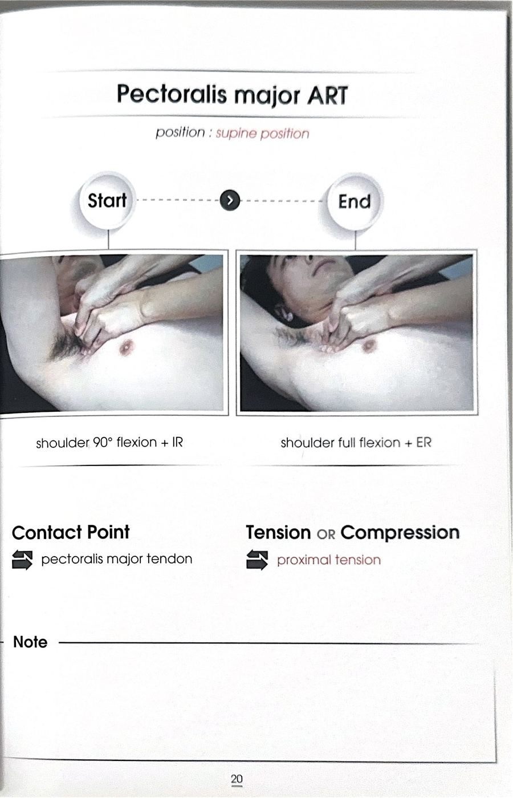
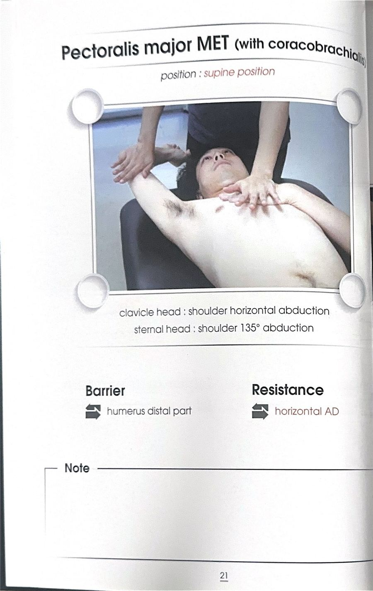

# 테크닉 61 | 대흉근 / 큰가슴근 / Pectoralis Major

## 이 사람에게 해!
- 외회전(ER) 제한이 있는 사람 (1순위 타깃) — 대흉근이 뻣뻣하면 외회전이 잘 안 나온다.
- 남성 중 외회전 제한이 있고 상의 탈의를 불편해하는 사람 — 대흉근 효과가 특히 좋다.
- 팔을 위로 들 때 제한·찝힘(충돌감)이 있는 사람 — 대흉근이 쇄골에 붙어 쇄골이 올라가는 것을 막기 때문.
- 앞가슴이 답답하다고 하는 사람 — 뻣뻣한 흉근이 흉통처럼 느껴지는 경우가 있다(심장 문제 감별은 별개).

## 핵심 한 줄
대흉근은 쇄골 파트(빗장뼈머리)와 흉골 파트(복장뼈머리)로 나뉘고 붙는 결이 달라 길이 검사도 파트별로 따로 한다 — 팔을 드는 동안 흉골 주변부터 쇄골 아래까지 라인을 쓸어주는 ART, 그리고 제한 있는 파트에서만 하는 MET로 접근한다. 대흉근이 쇄골을 잡고 있어 타이트하면 팔 들림 제한·어깨 충돌로 이어진다.

## 짧아지는 자세 vs 늘어나는 자세
- **짧아지는 자세:** 팔을 몸 앞으로 모으고 안쪽으로 돌리는 자세(수평모음 + 내회전).
- **늘어나는 자세:** 팔을 바깥·위로 벌리고 바깥으로 돌리는 자세(수평벌림/135° 벌림 + 외회전).

## 촉진 (Palpation)
**대상자 자세:** 바로 누운 자세

**손의 접촉:** ART 라인 그대로, **흉골 정중선보다 살짝 바깥쪽(가슴 쪽) 라인 ~ 쇄골 아래쪽**을 따라 대흉근 섬유를 확인한다. 흉골 쪽에서 쇄골 아래로 이어지는 넓은 결을 짚는다. 원문에서 "굉장히 아프고 효과는 굉장히 좋다"고 할 만큼 압통이 강한 부위이므로 처음엔 강도를 조절한다.

## ART 1
**자세:** 대상자 바로 누운 자세, 팔을 앞으로 나란히에서 내회전 → 외회전으로 보내는 동작 / 검사자 대상자 측방에서 흉골~쇄골 아래 라인에 손을 대고 유지

**방법:**
① 대상자는 팔을 앞으로 나란히(천장 쪽), 내회전된 자세에서 시작한다.
② 팔을 외회전 방향으로 보낸다(견갑골이 앞으로 났던 내회전 자세 → 외회전 자세로 가는 것이 대흉근 ART).
③ 검사자는 **흉골 주변부터 쇄골 아래쪽까지** 라인을 팔이 움직이는 동안 쓸어준다(흉골 → 쇄골 아래 방향). 잡은 손은 팔 쪽으로 가볍게 텐션을 주거나 흉골 쪽으로 당겨줘도 되고, 뭐든 가볍게 유지하며 같이 움직인다.
④ 팔은 교재의 만세 동작에만 국한하지 말고 **여러 방향(위로도, 90° 안쪽으로도, 사방으로)** 움직여준다 — 대흉근 결이 워낙 넓어 다양한 방향으로 자극하는 것이 좋다.
⑤ 흉골 정중선보다 왼쪽 가슴이면 약간 왼쪽으로 치우친 가슴 라인 + 쇄골 아래 파트를 설정해 쓸어준다.

**포인트:** 대흉근 결이 넓으므로 한 방향만이 아니라 여러 방향으로 팔을 움직이며 넓게 처리한다 / 압박하듯 찌르지 않고 라인을 따라 쓸어준다 / 매우 아픈 부위이므로 강도 조절

**구두 지시:** "팔을 앞으로 나란히 했다가 바깥으로 돌려주세요." / "천천히 여러 방향으로 팔을 움직여 주세요."

## MET 1
**자세:** 대상자 바로 누운 자세, 제한 있는 파트의 벌림 끝범위(쇄골=수평벌림, 흉골=약 135°/사선) / 검사자 대상자 머리 위쪽. 대상자 반대 팔은 가슴 쪽에 올려 눌러 몸통을 고정

**시작 자세:** 길이 검사에서 팔이 떴던(제한 있던) 파트의 벌림 끝범위. 그 끝범위에서 검사자가 **손목보다 팔꿈치·상완골 쪽에 '벽'을 만든다**(손목에 대면 팔꿈치만 꺾이는 보상이 생기므로 상완에 댄다).

**방법:**
① 제한 파트의 벌림 끝범위로 세팅(쇄골 파트면 수평벌림, 흉골 파트면 135° 사선).
② 검사자는 상완/팔꿈치 쪽에 벽을 대고, 대상자에게 **팔을 모으려는 힘**(수평모음 방향)을 주게 한다.
③ 숨 마시고 → 숨 참고 → 원래(모으는) 방향으로 **20% 힘 → 7초 유지**(하나~일곱 카운트).
④ "후" 힘 빼며(날숨) 팔을 약간 당겨주면서 가볍게 스트레칭(광배 MET처럼 당기며 신장).
⑤ 다음엔 더 벌어진(더 늘어난) 뒤쪽에서 다시 벽을 대고 반복 → **3~5회**.

**포인트:** 제한 있는 파트에서만 실시한다 / 벽은 손목이 아니라 상완/팔꿈치에 대서 팔꿈치만 꺾이는 보상을 줄인다 / 그냥 세게 스트레칭하면 근육이 아니라 어깨 전면부 힘줄이 늘어나는 느낌이 나므로(잘못된 스트레칭), 가볍게 모으고 이완을 반복해 근육에 자극을 주는 방식으로 마무리 / 셀프로도 가능(주먹 쥐고 팔을 모으려는 힘 → 이완 반복)

## F3 참고 이미지 (소책자)
소책자 실측 확인(2026-07-19, `테크닉 소책자.pdf` 스캔본 물리 20~21페이지 기준). 아래는 해당 물리 페이지를 좌/우 절반으로 크롭한 이미지 — 사진 박스 안 손 위치·압력 방향과 함께 Contact Point/Tension·Compression(또는 Barrier/Resistance) 필드도 그대로 보인다.

## 임상 포인트
| 포인트 | 내용 |
|---|---|
| 두 파트 구분 | 쇄골 파트(수평벌림 검사)·흉골 파트(135° 검사)로 나눠 길이 검사 후, 제한 있는 파트에만 MET |
| 제한 빈도 | 흉골 파트 제한이 쇄골 파트보다 훨씬 흔함(팔 위로 들 때 뜨는 경우가 더 많음) |
| 쇄골 연결 | 대흉근이 쇄골에 붙어 있어, 타이트하면 팔 들 때 쇄골 거상을 막아 팔 들림 제한·충돌감 유발 |
| 남성 적응증 | 남성 외회전 제한 + 탈의 불편 케이스에 특히 효과가 좋다고 강조됨 |
| 스트레칭 오류 | 근육이 뻣뻣하면 힘줄(어깨 전면부)에서 늘어나는 느낌 → 잘못된 스트레칭. 가볍게 수축-이완 반복 후 신장 |

## 금기 · 주의
- 제한이 없는 파트에는 MET를 하지 않는다(제한 파트에만 실시).
- 압통이 매우 강한 부위이므로 처음엔 강도를 조절한다.
- 벽을 손목에 대 팔꿈치만 꺾이는 보상이 생기지 않게 상완/팔꿈치에 댄다.

## 한 줄 정리
> "대흉근은 쇄골·흉골 두 파트로 나눠 길이 검사하고 제한 있는 파트만 공략 — 팔을 여러 방향으로 보내며 흉골에서 쇄골 아래까지 쓸어주는 ART, 상완에 벽 대고 20%·7초로 모으는 MET. 남성 외회전 제한에 특효."

## 체인 링크
- **의심근육→** 소흉근 — 대흉근 깊은 층에 있는 앞가슴 짝 근육(함께 확인)
- **테크닉→** 미기재
- **재검사→** 대흉근 길이 검사(쇄골 파트) / 대흉근 길이 검사(흉골 파트) / 외회전 검사 — 테크닉 후 동일 검사로 복귀

<!-- ok -->
