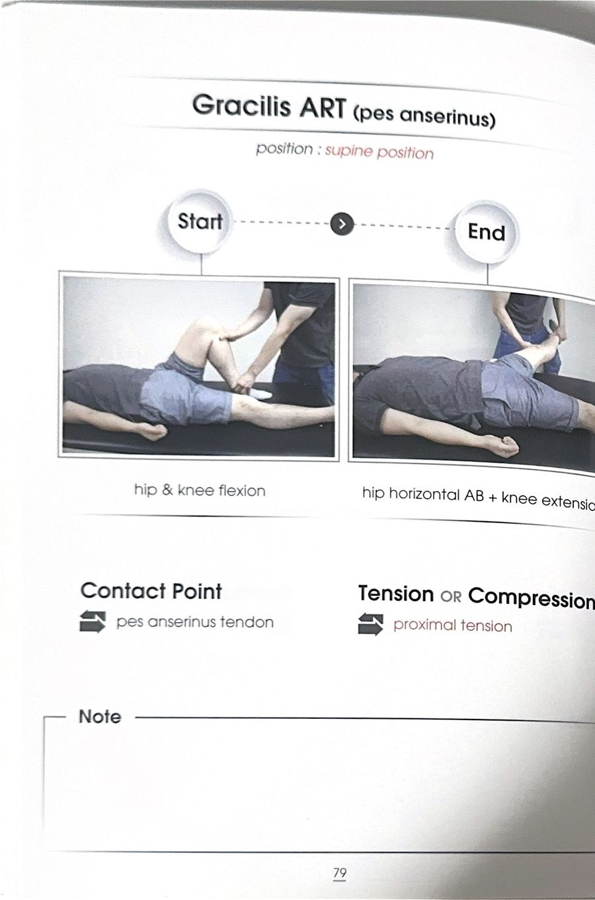

# 테크닉 42 | 박근 / 두덩정강근 / Gracilis

## 이 사람에게 해!
- 무릎이 안쪽으로 무너지는(동적 외반슬) 패턴이 있는 사람 — 박근은 봉공근·반건양근과 함께 거위발을 이루어 무릎 내측 안정자로 작용한다.
- 다리가 안으로 모이거나 내회전 패턴을 보이는 사람 — 내전근 그룹(박근 포함)이 뻣뻣해지면 다리가 모여 보이는 패턴을 만들 수 있다는 것이 강사의 설명. 단, **강사 판단(1급 정보):** 이런 패턴이 보일 때 "내전근이 짧아져서"라고 단정하기보다, 그 반대(중둔근·대둔근 등 벌림·신전 주동근의 약화·저활성)에 무게를 두고 접근해야 한다 — 안 좋은 쪽은 대개 약해진 쪽이지 세진 쪽이 아니라는 논리(운동으로 중립을 만드는 접근을 권장).

## 핵심 한 줄
박근은 내전근 5형제 중 유일하게 두 관절(고관절·무릎)을 지나는 이관절근으로, 아래쪽 치골 가지에서 시작해 경골 안쪽 융기(거위발)에 닿으며, 내전근 중에서는 힘을 크게 못 내는 얇은 근육으로 취급하는 교재도 있을 만큼 "얇다(박薄)"는 이름 그대로 얇고 긴 근육이다.

## 짧아지는 자세 vs 늘어나는 자세
- **짧아지는 자세:** 고관절 내전 방향(다리를 안으로 모으는 자세).
- **늘어나는 자세:** 고관절 벌림(외전) 방향. 세부 스트레칭 시연은 원문에 확인되지 않는다 — 지어내지 않고 이 정도만 남긴다.

## 촉진 (Palpation)
원문 전사에는 박근 단독 촉진 시연이 확인되지 않는다 — 확인된 것은 대내전근 촉진 설명("허벅지 안쪽에 재봉선을 따라 가운데서부터 꾹 눌러서 내려가면 걸리는 뼈"는 대내전근의 어덕터 투버클을 가리키는 것으로 박근과는 다른 지점)이며, 박근 자체의 촉진법은 지어내지 않고 미기재로 남긴다.

## F3 참고 이미지 (소책자)
소책자 실측 확인(2026-07-19, `테크닉 소책자.pdf` 스캔본 물리 79~80페이지 기준). 아래는 해당 물리 페이지를 좌/우 절반으로 크롭한 이미지 — 사진 박스 안 손 위치·압력 방향과 함께 Contact Point/Tension·Compression(또는 Barrier/Resistance) 필드도 그대로 보인다.

물리 80페이지(Adductor magnus & Gracilis MET)는 대내전근 카드와 이미지 공유.

## 임상 포인트
| 포인트 | 내용 |
|---|---|
| 유일한 이관절 내전근 | "이 두성 정관근(박근)이 투조인트 머슬" — 나머지 4개 내전근(치골근·장내전근·단내전근·대내전근)은 모두 고관절만 지나는 단관절근인 반면, 박근만 고관절+무릎 두 관절을 지난다 |
| 부착 위치 특이점 | "박근만 밑으로(경골까지) 삐죽 튀어나와 있고 나머지는 다 위(대퇴골)에서 부착된다" — 다른 내전근들과 달리 무릎까지 내려가 거위발을 이룬다는 점에서 구분됨 |
| 힘 기여도에 대한 견해차 | 원문: "AD 주동근 취급 안 하는 교재도 있다... 너무 얇아서 힘을 잘 못 낸다는 책도 있다" — 학자마다 견해가 갈리므로 "이 책에서는 취급 안 했구나" 정도로 이해하면 된다는 강사의 안내 |
| 내전근 그룹 공통 특징 | 골반 안정화(코어 근육과 협업), 약화저활성이 흔해 뻣뻣·과활성으로 이어지기 쉬움, 스트레칭보다 코펜하겐 내전근 운동 등 몸통 개입을 동반한 신장성 운동이 권장됨(상세는 `테크닉_대내전근.md` 참조) |
| MET/ART 시연 여부 | 원문 전사에는 박근에 대한 개별 수기 ART/MET 시연이 확인되지 않는다 — 지어내지 않고 미기재로 남긴다 |

## 금기 · 주의
원문에 박근 단독의 금기·주의사항은 확인되지 않는다 — 지어내지 않고 미기재로 남긴다.

## 한 줄 정리
> "내전근 5형제 중 유일하게 무릎까지 내려가는 이관절근 — 봉공근·반건양근과 함께 거위발을 이뤄 무릎이 안으로 무너지는 걸 막아주지만, 얇아서 힘 자체는 약하다는 평가가 많다."

## 체인 링크
- **의심근육→** 봉공근·반건양근(거위발 3인방) · 치골근·장내전근·단내전근·대내전근(내전근 5형제, 원문 근거: "이 다섯 가지의 근육이 내전근들이에요")
- **테크닉→** 미기재
- **재검사→** 고관절 벌림 패턴 검사

<!-- ok -->
