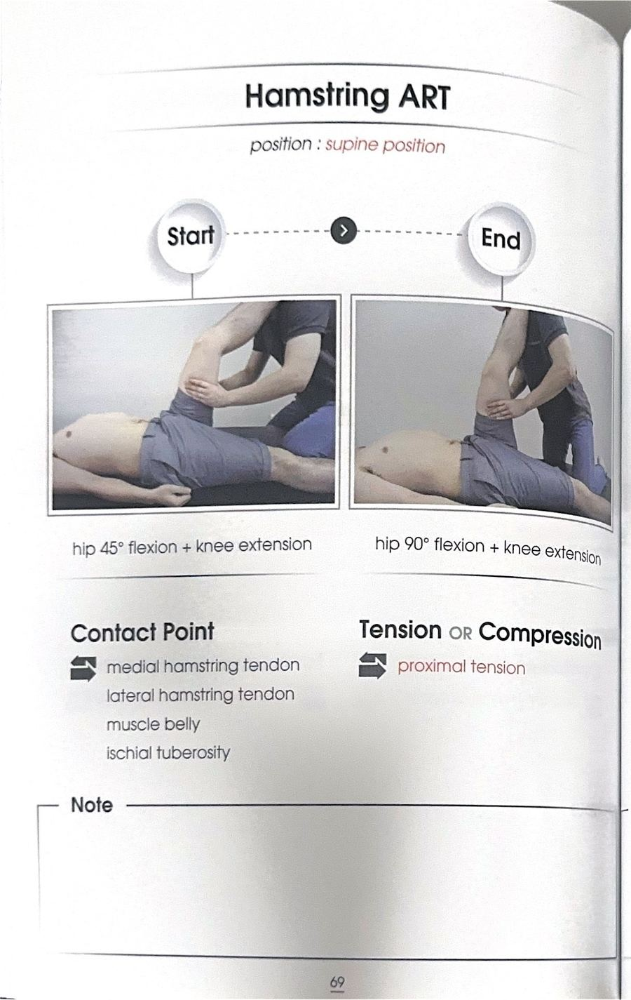
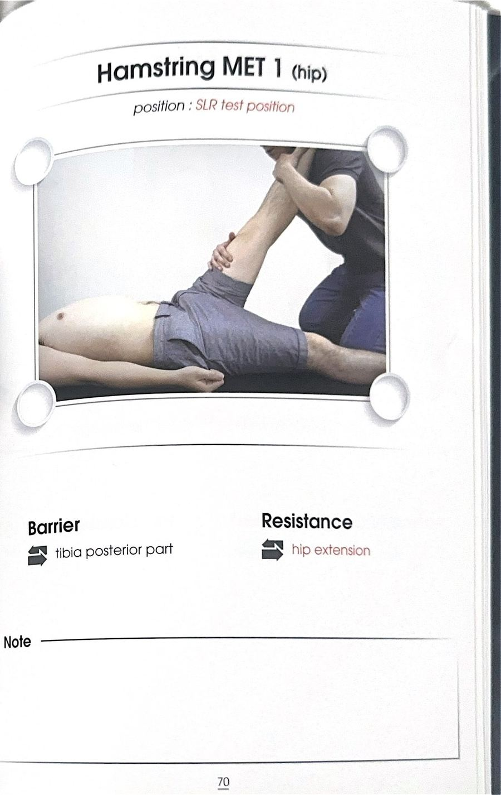

# 테크닉 39 | 반건양근 / 반힘줄모양근 / Semitendinosus

## 이 사람에게 해!
- 무릎 안쪽으로 무너지는(동적 외반슬) 패턴이 있는 사람 — **해부학적 이유:** 반건양근은 봉공근·박근과 함께 "거위발(구스풋)" 힘줄을 이루며 경골 안쪽에 붙는다. 이 3인방이 무릎이 안쪽으로 무너지려는 힘에 브레이크를 걸어주는 "무릎의 내측 안정자" 역할을 한다.
- 대둔근 기능이 떨어져 있는 사람 — 대퇴이두근과 마찬가지로 반건양근도 대둔근과 고관절 신전 협력근 우세 관계라, 대둔근이 일을 못 하면 보상적으로 더 많이 일하게 된다.
- 무릎 안쪽 통증이 있지만 거위발 힘줄 자체를 직접 마사지해도 잘 안 낫는 사람 — 원문 강조: 거위발 3인방은 브레이크 역할일 뿐 원인 근육이 아니다. 무릎이 안으로 들어가는 것은 결과이며, 진짜 접근은 둔근과 발 세팅이다.

## 핵심 한 줄
반건양근은 좌골조면(궁둥뼈거친면)에서 시작해 힘줄이 얇고 표층으로 앞쪽으로 돌아 나가 경골 안쪽 융기(거위발)에 붙는 메디얼(안쪽) 햄스트링으로, 박근·반막양근과 겹쳐 주행하다가 셋 중 유일하게 봉공근·박근과 함께 거위발을 이루어 무릎의 내측 안정자 역할을 한다.

## 짧아지는 자세 vs 늘어나는 자세
- **짧아지는 자세:** 무릎 굴곡 + 고관절 신전(대둔근과 협력근 우세 관계이므로 대둔근이 하는 신전 움직임을 함께 담당).
- **늘어나는 자세:** 무릎 신전 + 고관절 굴곡. 별도의 세부 스트레칭 자세 시연은 원문에 확인되지 않는다 — 지어내지 않고 이 정도만 남긴다.

## 촉진 (Palpation)
원문 전사에는 반건양근 단독 촉진 시연이 확인되지 않는다 — 확인된 것은 아래 구분법(힘줄근 vs 막근 구분: 얇고 힘줄 같은 쪽이 반건양근)과 거위발 부착부 설명이며, 지어내지 않고 미기재로 남긴다.

**구분 포인트(원문 근거):** "둘 다 경골 안쪽 융기에 부착되긴 하는데, 왼쪽(반건양근)이 얇고 오른쪽(반막양근)이 두껍다 — 얇은 쪽이 힘줄근(건양근)"이라는 설명으로 두 근육을 구분한다. 반건양근은 반막양근보다 표층(슈퍼피셜)에서 겹쳐 앞으로 돌아 나가 거위발에 붙는다.

## 운동처방
반건양근은 다른 햄스트링과 함께 신장성 조절 운동(등척성→단축성→신장성 순서, 브릿지 다리 멀리 뻗기, 볼 브릿지 등)의 대상이며, 개별 근육을 따로 겨냥한 운동은 원문에서 제시되지 않는다 — 상세 프로토콜은 `테크닉_대퇴이두근.md`의 "운동처방" 섹션과 동일하므로 그쪽을 참조. 여기서는 중복 기재하지 않고 미기재로 남긴다.

## F3 참고 이미지 (소책자)
소책자 실측 확인(2026-07-19, `테크닉 소책자.pdf` 스캔본 물리 69~70페이지 기준). 아래는 해당 물리 페이지를 좌/우 절반으로 크롭한 이미지 — 사진 박스 안 손 위치·압력 방향과 함께 Contact Point/Tension·Compression(또는 Barrier/Resistance) 필드도 그대로 보인다.

소책자는 햄스트링 3근육(대퇴이두근·반건양근·반막양근)을 'Hamstring' 통합 기법으로 다룸 — 개별 분리 사진 없음. 무릎 단계 기법(Hamstring MET 2 knee, 물리 71페이지)은 이번 스캔 원본에 해당 스프레드 사진이 없어(촬영 누락 추정) 확보하지 못함.

## 임상 포인트
| 포인트 | 내용 |
|---|---|
| 거위발(구스풋) 3인방 | 봉공근·박근·반건양근 순서로 경골 안쪽에 겹쳐 부착 — 무릎의 내측 안정자. 반막양근은 이 그룹에 포함되지 않음(더 뒤쪽·깊은 층에 별도 부착) |
| 힘줄근 vs 막근 구분 | 반건양근(왼쪽, 얇음, 힘줄=건) / 반막양근(오른쪽, 두꺼움, 막=막양) — "반"은 세미(semi, 절반)라는 뜻으로 절반이 힘줄모양(건양)이다/막모양(막양)이다라는 이름의 유래 |
| 대둔근과의 관계 | 대둔근 기능 저하 시 햄스트링(반건양근 포함)이 고관절 신전 역할을 보상적으로 대신하며 단축·뻣뻣·과활성·긴장되기 쉬움 |
| MET/ART 시연 여부 | 원문 전사에는 반건양근에 대한 개별 수기 ART/MET 시연이 확인되지 않는다 — 지어내지 않고 미기재로 남긴다 |

## 금기 · 주의
원문에 반건양근 단독의 금기·주의사항은 확인되지 않는다 — 지어내지 않고 미기재로 남긴다.

## 한 줄 정리
> "얇고 힘줄 같은 쪽이 반건양근 — 봉공근·박근과 함께 거위발을 이루어 무릎이 안으로 무너지는 힘에 브레이크를 건다."

## 체인 링크
- **의심근육→** 반막양근(같은 메디얼 햄스트링, 겹쳐서 함께 주행) · 봉공근·박근(거위발 3인방, 원문 근거: "무슨 발? 거위발... 앞에서부터 봉공근, 박근, 반거냥근, 반힘줄근까지 3개의 친구가 잘 보이죠") · 대둔근(고관절 신전 협력근 우세 관계)
- **테크닉→** 미기재
- **재검사→** 고관절 신전 패턴 검사 / 대둔근근력검사

<!-- ok -->
