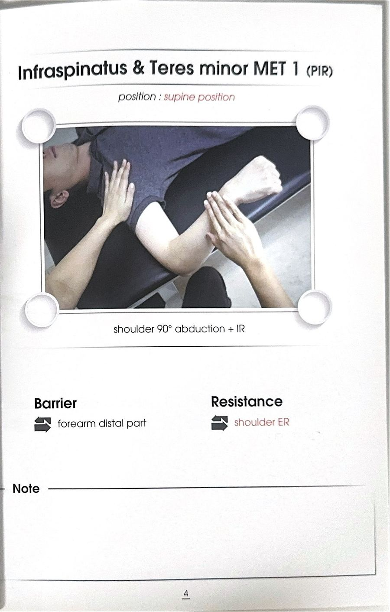

# 테크닉 15 | 소원근 / 작은원근 / Teres Minor

## 이 사람에게 해!
- 오십견(동결견) 초기, 어깨 후면이 뻣뻣하고 팔을 돌릴 때 뻑뻑함을 느끼는 사람 — 극하근과 함께 회전근개 후면부를 이루며, 특징 자체가 단축·뻣뻣해지는(가동성 저하) 경향을 가진다.
- 팔을 옆으로 벌려 들었을 때 좌우 중 한쪽이 불편한 사람 — 회전근개 후면부(극하근·소원근)가 뻣뻣해지면 어깨 뒤쪽 스트레칭으로 완화될 수 있다.
- 회전근개 재활이 필요한 사람 전반 — **강사 판단(1급 정보):** 회전근개 4개(극상근·극하근·소원근·견갑하근)는 개별로 힘을 쓰는 것이 아니라 "동시 활성"되어 GH 조인트의 동적 안정자 역할을 하며, 겉근육보다 먼저 수축하는 "선활성"이 되어야 한다.

## 핵심 한 줄
소원근("작은 원"이라는 뜻, 테레스=원형)은 견갑골 외측연(겨드랑이쪽 모서리)에서 시작해 상완골 큰결절(대결절) 뒤쪽에 붙는 회전근개 중 하나로, 극하근과 함께 외회전의 주동근이며, 극하근과 마찬가지로 단축·뻣뻣해지기 쉬운 근육이다.

## 짧아지는 자세 vs 늘어나는 자세
- **짧아지는 자세:** 팔을 내회전(안쪽으로 돌린) 상태로 오래 두는 자세
- **늘어나는 자세:** 팔을 몸 앞으로 최대한 짧게(견갑골은 고정) 만든 뒤 당기는 스트레칭 자세 (극하근과 동일한 "50견 스트레칭" 참조)

## 촉진 (Palpation)
전사문에서는 소원근을 극하근과 묶어서 함께 촉진하는 방법만 확인된다(개별 분리 촉진법은 확인되지 않음). 견갑골 외측연(6번 랜드마크로 촉진했던 바깥쪽 모서리) 쪽에 부착되며, 대상자를 엎드리게 한 뒤 어깨뼈 가시를 먼저 찾고 그 아래쪽에 손가락 두 개를 가로로 위치시켜 촉진한다 — 이 두 손가락이 위치한 지점이 극하근과 소원근이다. 외회전 시 근육이 볼록해지는지로 촉진 위치를 검증한다.

## ART 1
전사문에는 소원근에 대한 클리닉형 ART(압박 고정 + 능동 이동) 기법은 별도로 확인되지 않는다. 확인되는 것은 극하근과 함께 시연된 아래의 자가/수동 스트레칭 하나이며, 지어내지 않고 이를 "스트레칭 1"로 정리한다.

### 스트레칭 1 — "50견 스트레칭" (극하근·소원근 후면부 스트레칭)
**자세:** 대상자가 스스로 시행 가능한 스트레칭

**방법:**
① 팔을 편하게 쭉 뻗어 당기는 일반적인 스트레칭은 하지 않는다 — 이렇게 하면 견갑골이 앞으로 끌려가며 등 쪽(광배근 방향)이 늘어나 버리기 때문에, 목표로 하는 어깨 후면(극하근·소원근)이 아니라 다른 부위가 스트레칭된다.
② 대신 견갑골이 움직이지 못하도록 고정한 채, 팔을 최대한 짧아지게 만든 상태에서 당긴다.
③ 그 상태에서 당기면 어깨 뒤쪽(극하근·소원근)만 국소적으로 스트레칭된다.

**보조 도구:** 폼롤러로 어깨 뒤쪽을 문지르는 이완법도 함께 언급됐다.

**재검사 확인:** 전사문에는 이 스트레칭 직후의 별도 재검사 절차는 확인되지 않는다.

## F3 참고 이미지 (소책자)
소책자 실측 확인(2026-07-19, `테크닉 소책자.pdf` 스캔본 물리 4~5페이지 기준). 아래는 해당 물리 페이지를 좌/우 절반으로 크롭한 이미지 — 사진 박스 안 손 위치·압력 방향과 함께 Contact Point/Tension·Compression(또는 Barrier/Resistance) 필드도 그대로 보인다.

소책자는 극하근+소원근을 'Infraspinatus & Teres minor' 통합 기법으로 다룸 — 개별 분리 사진 없음(극하근 카드와 이미지 공유).

## 임상 포인트
| 포인트 | 내용 |
|---|---|
| 외회전 주동근 (극하근과 함께) | 극하근·소원근 두 개가 GH 조인트의 외회전 주동근이다 — 질문받으면 "가시 아래근과 작은 원근이에요" 두 개를 함께 답해야 한다 |
| 회전근계(로테이터커프)의 정의 | "회전을 잘해서 회전근계가 아니라, 상완골을 회전하듯이 감싸고 있어서 회전근계"라는 강사 정정 — 항상 팀으로 "동시 활성"되며 GH 조인트의 동적 안정자 역할을 한다 |
| 견봉하 충돌과의 연관 | 회전근개(소원근 포함)가 겉근육보다 먼저 "선활성"되지 못하면 어깨가 집히는 견봉하 충돌이 발생할 수 있다 |
| 50견(동결견) 자가관리 | 팔 길이를 늘리는 일반 스트레칭이 아니라 견갑골을 고정한 채 짧게 만들어 당기는 방식이어야 어깨 후면(극하근·소원근)이 정확히 늘어난다 |
| ART/MET 시연 여부 | 원문 전사문에는 소원근에 대한 클리닉형 ART나 MET(등척성수축) 시연은 확인되지 않는다 — 확인된 것은 위 자가 스트레칭(50견 스트레칭)뿐이며, 지어내지 않고 미기재로 남긴다 |

## 금기 · 주의
- 전사문에서 소원근에 특화된 금기·주의 사항은 별도로 언급되지 않는다 — 회전근개 전반의 원칙(선활성 필요, 개별 훈련보다 팀 훈련 우선)만 확인된다.

## 한 줄 정리
> "소원근은 극하근과 함께 외회전 주동근이자 회전근개의 팀플레이어 — 견갑골을 고정한 채 팔을 짧게 만들어 당기는 스트레칭으로 후면을 함께 풀어준다."

## 체인 링크
- **의심근육→** 극하근 (같은 외회전 주동근, 촉진도 함께 묶여 시연됨)
- **테크닉→** 미기재
- **재검사→** 미기재 — 전사문에 이 근육에 특화된 재검사 절차가 확인되지 않음

<!-- ok -->
