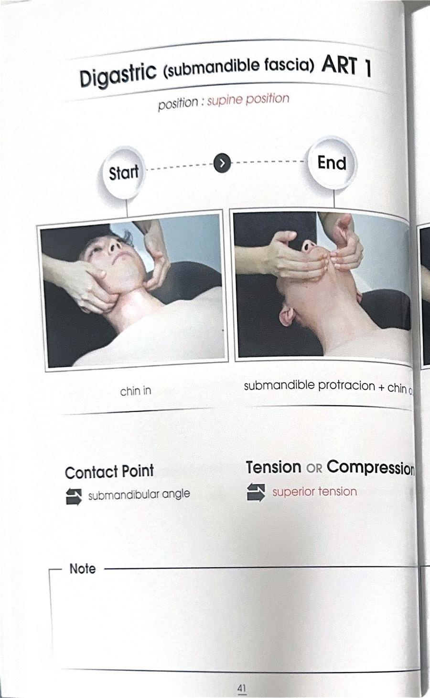
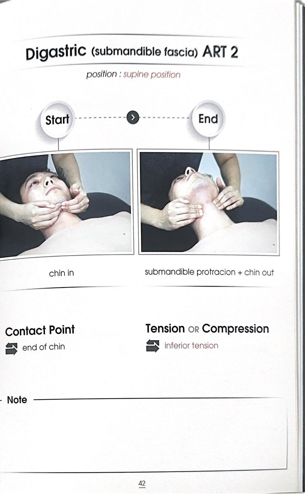

# 테크닉 19 | 이복근 / Digastric

## 이 사람에게 해!
전사문에서는 이복근에 대해 부착 지점과 촉진 위치만 짧게 언급됐을 뿐, 어떤 증상·자세를 가진 대상자에게 적용하는지에 대한 강사의 설명은 확인되지 않는다 — 지어내지 않고 미기재로 남긴다.

## 핵심 한 줄
이복근은 유양돌기에서 시작해 턱(하악) 앞쪽에 붙는 근육으로, 턱을 움직이며 씹는 작용을 돕는다.

## 짧아지는 자세 vs 늘어나는 자세
전사문에는 이복근의 짧아지는 자세·늘어나는 자세에 대한 설명이 확인되지 않는다 — 미기재로 남긴다.

## 촉진 (Palpation)
턱 밑을 손가락으로 딱 눌러 좌우로 밀듯이 문지르면 걸리는 조직이 이복근이다. 턱 밑에서 앞으로 튀어나와 있는 형태로 촉진된다.

## ART 1
전사문에는 이복근에 대한 ART·MET·스트레칭 등 어떤 형태의 치료 기법도 시연되지 않는다 — 지어내지 않고 미기재로 남긴다.

## F3 참고 이미지 (소책자)
소책자 실측 확인(2026-07-19, `테크닉 소책자.pdf` 스캔본 물리 41~42페이지 기준). 아래는 해당 물리 페이지를 좌/우 절반으로 크롭한 이미지 — 사진 박스 안 손 위치·압력 방향과 함께 Contact Point/Tension·Compression(또는 Barrier/Resistance) 필드도 그대로 보인다.

## 임상 포인트
| 포인트 | 내용 |
|---|---|
| 서술 분량 | 전사문에서 이복근은 부착 지점(유양돌기~턱 앞쪽)과 촉진 위치(턱 밑을 눌러 좌우로 밀면 걸림) 한 문단 정도로만 짧게 다뤄졌다 — 기능의 상세 설명(하악 개구·설골 고정 등 일반적으로 알려진 기능), 임상적 연관 근육, 금기 사항은 전사문에서 확인되지 않는다 |
| ART/MET 시연 여부 | 원문 전사문에는 이복근에 대한 어떤 치료 기법(ART/MET/스트레칭)도 시연되지 않는다 — 지어내지 않고 미기재로 남긴다 |

## 금기 · 주의
전사문에는 이복근에 특화된 금기·주의 사항이 확인되지 않는다 — 미기재로 남긴다.

## 한 줄 정리
> "이복근은 턱 밑을 눌러 좌우로 밀면 걸리는, 씹기를 돕는 근육 — 이번 강의에서는 부착과 촉진만 짧게 다뤄졌다."

## 체인 링크
- **의심근육→** 미기재 — 전사문에서 이복근과 다른 근육의 연관성이 언급되지 않음
- **테크닉→** 미기재
- **재검사→** 미기재

<!-- ok -->
