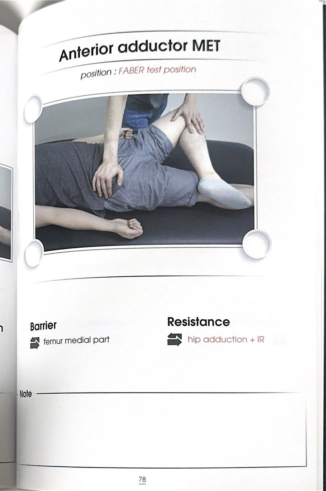

# 테크닉 44 | 장내전근 / 긴모음근 / Adductor Longus

## 이 사람에게 해!
- 골반 안정성이 떨어져 한 발 서기·달리기 중 골반이 흔들리는 사람 — **해부학적 이유:** 내전근들은 모두 치골 쪽으로 골반 중심부를 향해 부착되기 때문에, 걷거나 뛸 때 골반이 무너지지 않게 잡아주는 안정화 역할을 한다. 몸통 안정화 근육(코어)과 협업하는데, 코어 기능이 떨어지면 내전근(장내전근 포함)이 부담을 더 지게 되어 단축·뻣뻣·과활성·긴장되기 쉽다.
- 폼롤러로 허벅지 안쪽을 문질렀을 때 유독 아팠던 사람 — 원문에서 내전근은 뻣뻣해지기 쉬운 근육으로 자주 언급되며("나 이거 아무것도 안 했는데 왜 이렇게 아프지"), 그 원인은 몸통 기능 저하 → 내전근 보상이라는 것이 강사의 반복 설명.
- 달리기 후 사타구니 안쪽이 뻐근한 사람 — **강사 판단(1급 정보):** 다리가 앞으로 나갈 때는 안테리어 내전근이 굴곡근으로, 다리가 뒤로 갈 때는 신전근으로 역할이 계속 바뀌기(확확 바뀌기) 때문에 굴곡·신전 양쪽에서 다 참여하게 되어 "사역마"처럼 쉴 틈 없이 일한다.

## 핵심 한 줄
장내전근은 위쪽 치골 몸통(슈피리어 퓨빅 바디)에서 시작해 거친선(리니아 아스페라) 중간 파트에 붙는 안테리어 어덕터로, 내전(AD)을 주동하며 굴곡·내회전에도 협력근으로 참여한다 — 달리기처럼 다리가 앞뒤로 움직일 때는 굴곡·신전 기능이 자세에 따라 계속 바뀌는 근육이다.

## 짧아지는 자세 vs 늘어나는 자세
- **짧아지는 자세:** 고관절 내전 + 굴곡 + 내회전 방향(단, 다리가 몸통보다 뒤로 가면 신전근으로 기능이 바뀜).
- **늘어나는 자세:** 고관절 벌림(외전) + 신전 + 외회전 방향(다리 위치에 따라 반대로도 작용). 세부 스트레칭 시연은 원문에 확인되지 않는다 — 지어내지 않고 이 정도만 남긴다.

## 촉진 (Palpation)
원문 전사에는 장내전근 단독 촉진 시연이 확인되지 않는다 — 확인된 것은 부착부 설명(치골 몸통·거친선 중간)뿐이며, 지어내지 않고 미기재로 남긴다.

## 운동처방 (내전근 그룹 공통)
원문에는 ART/MET 형태의 개별 수기 기법은 확인되지 않으며, 대신 아래 내전근 그룹 공통 운동 원칙이 상세히 제시되었다:
- 내전근 스트레칭만 반복하기보다 몸통(코어) 운동과 내전근의 신장성 수축 운동을 함께 해준다.
- 힙 어덕션 운동(다리 벌렸다 모으는 머신 운동) 시 밴드로 몸통을 살짝 당겨 놓는 등 몸통 개입을 늘리면 내전근에 힘이 더 잘 들어간다.
- **코펜하겐 내전근 운동**: 옆으로 누워 사이드 플랭크 자세에서 위쪽 다리를 의자 등에 올려 버티는 자세(코펜하겐 플랭크)로, 골반을 앞뒤로 움직이며 진행 — 몸통까지 함께 훈련되는 "1티어 운동"으로 소개됨.
- 사이드 스플릿(버티며 천천히 다리 벌리기)도 좋은 대안, 상지로 밴드를 당기거나 들면서 난이도를 높일 수 있음.
- CKC(닫힌 사슬) 운동으로 진행하는 것을 선호.

## F3 참고 이미지 (소책자)
소책자 실측 확인(2026-07-19, `테크닉 소책자.pdf` 스캔본 물리 77~78페이지 기준). 원문 페이지 제목이 "Anterior adductor ART/MET"로, 특정 근육 하나가 아니라 안테리어 어덕터 그룹(치골근·장내전근·단내전근) 전체를 대상으로 한 기법이다 — 이 카드의 "임상 포인트"에도 이미 "안테리어 어덕터 3형제"로 명시돼 있어, 세 카드(장내전근/단내전근/치골근)에 동일 이미지를 공유 반영한다. 사진 박스 안 손 위치·압력 방향과 Contact Point/Barrier·Resistance 필드도 그대로 보인다.

## 임상 포인트
| 포인트 | 내용 |
|---|---|
| 안테리어 어덕터 3형제 | 치골근(가장 위) → 장내전근(중간) → 단내전근(위쪽 거친선까지) 순서로 앞쪽에 위치 |
| 기능이 자세에 따라 바뀜 | 안테리어 내전근들은 해부학적 자세에서는 굴곡근이지만, 다리가 몸통보다 뒤로 가면 신전근으로 기능이 전환된다 — 달리기 중 내전근이 뻐근해지는 이유로 설명됨 |
| 사역마 비유 | "내전근은 사역마다 — 굴곡할 때도 신전할 때도 계속 참여하기 때문에 쉴 틈이 없어 뻣뻣해지기 쉽다" |
| X다리/오다리 관련 | 안테리어 어덕터가 뻣뻣해져 다리가 내전+내회전으로 끌려간 것처럼 보여도, 실제 원인은 반대편(둔근)의 약화 저활성인 경우가 많다는 것이 강사의 반복 논리 — "약한 쪽에 베팅해야 한다" |
| MET/ART 시연 여부 | 원문 전사에는 장내전근에 대한 개별 수기 ART/MET 시연이 확인되지 않는다 — 확인된 것은 위 그룹 공통 운동처방뿐이며, 지어내지 않고 미기재로 남긴다 |

## 금기 · 주의
원문에 장내전근 단독의 금기·주의사항은 확인되지 않는다 — 지어내지 않고 미기재로 남긴다.

## 한 줄 정리
> "치골 몸통에서 거친선 중간까지 붙는 안테리어 어덕터 — 굴곡·신전 양쪽에서 다 일하는 사역마 근육이라 뻣뻣해지기 쉽고, 코펜하겐 내전근 운동이 1티어 처방이다."

## 체인 링크
- **의심근육→** 치골근·단내전근(안테리어 어덕터 그룹) · 대내전근(내전근 5형제, 원문 근거: "이 다섯 가지의 근육이 내전근들이에요")
- **테크닉→** 미기재
- **재검사→** 고관절 벌림 패턴 검사

<!-- ok -->
