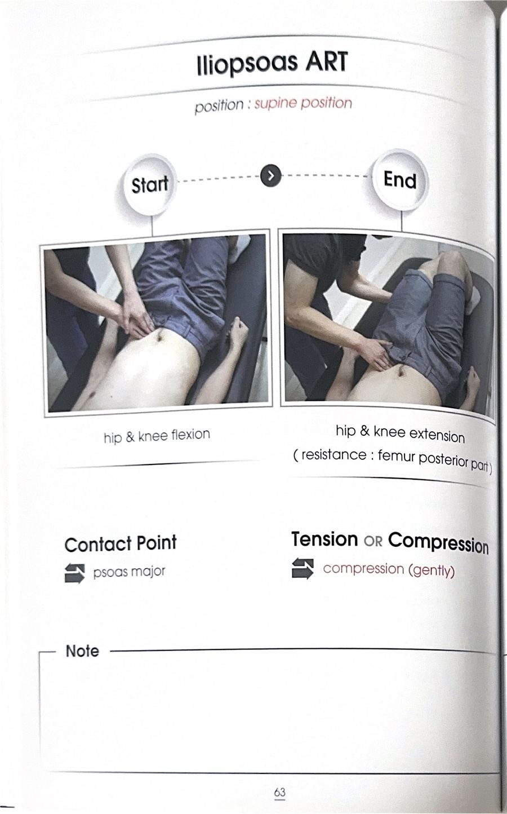
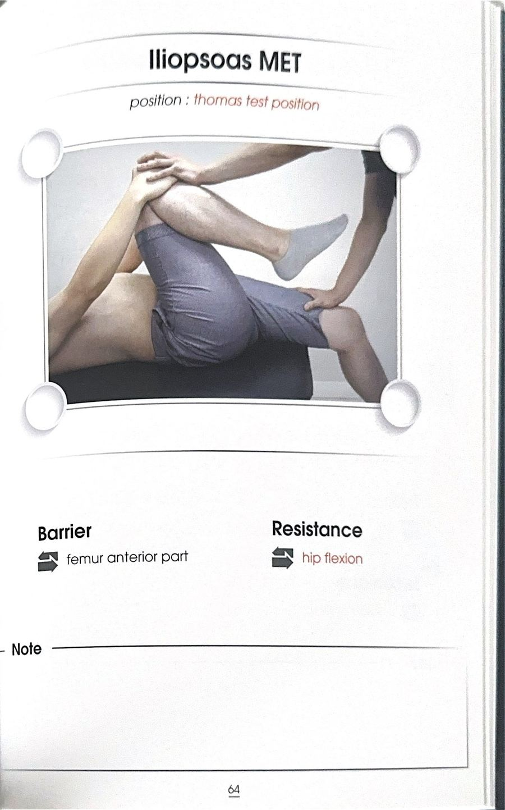

# 테크닉 30 | 장요근 / 대요근 / Psoas Major (Iliopsoas)

## ⚠️ 알려진 한계 (먼저 읽을 것)
3.24.md 강의 전사문에는 대요근(스파스 메이저, Psoas Major)이 두 차례 짧게 언급될 뿐, 기시·정지·촉진·ART·MET 등 본격적인 강의 내용은 등장하지 않는다. 강사는 강의 중 "요방형근·대요근은 이 부분 뒤에서 배울 거예요"라고 명시적으로 예고했고, 실제 상세 강의는 이 회차(3.24) 이후의 다른 세션(하지·고관절 유닛으로 추정)에서 다뤄졌을 가능성이 높다. 지어내지 않는다는 원칙에 따라 이 카드는 3.24.md에서 확인되는 내용만 담고, 나머지는 모두 "미기재"로 남긴다. 추후 하지·고관절 관련 원본 전사문이 확인되면 이 카드를 보강해야 한다.

## 이 사람에게 해!
원문에 확인되는 임상 적응증이 없다 — 지어내지 않고 미기재로 남긴다.

## 핵심 한 줄
대요근(장요근을 이루는 근육 중 하나)은 요추 안정화에 관여하는 근육으로, 횡격막·요방형근과 근막으로 서로 연결되어 있어 횡격막의 기능이 떨어지면 그 문제가 대요근과 요방형근에도 함께 번질 수 있다고 언급된다 — 단, 이 근육 자체의 기시·정지·기능에 대한 상세 설명은 3.24.md에는 등장하지 않는다.

## 짧아지는 자세 vs 늘어나는 자세
원문에 확인되지 않는다 — 미기재.

## 촉진 (Palpation)
원문에 확인되지 않는다 — 미기재.

## ART/MET
원문에 확인되지 않는다 — 미기재.

## F3 참고 이미지 (소책자)
소책자 실측 확인(2026-07-19, `테크닉 소책자.pdf` 스캔본 물리 63~64페이지 기준). 아래는 해당 물리 페이지를 좌/우 절반으로 크롭한 이미지 — 사진 박스 안 손 위치·압력 방향과 함께 Contact Point/Tension·Compression(또는 Barrier/Resistance) 필드도 그대로 보인다.

## 임상 포인트
| 포인트 | 내용 |
|---|---|
| 언급 맥락 1 | "허리 안정성에 있어서 허리를 지지해주는 뒤에서 배울 요방형근, 장요근, 기립근, 다열근 이런 친구들이 중요하다"는 문장에서, 횡격막 역시 이들과 함께 요추 안정화에 기여하는 근육이라는 맥락으로 함께 거론됨 |
| 언급 맥락 2 | "요근과 요방형근 — 이게 아까 제가 대요근이라고 적었던 부분이고 요방형근... 이런 친구들과 서로 연결되어 있다"고 설명하며, 횡격막이 삐끗하면(기능이 떨어지면) 그 영향이 대요근·요방형근에도 함께 번진다고 언급됨(근막 연결) |
| 예고된 후속 강의 | 강사가 "이 부분 뒤에서 배울 거예요"라고 두 차례 명시적으로 예고 — 즉 3.24.md 회차에서는 아직 본 강의가 진행되지 않았음을 스스로 밝힘 |

## 금기 · 주의
원문에 확인되지 않는다 — 미기재.

## 한 줄 정리
> "이 회차 전사문에는 '뒤에서 배운다'고 예고만 된 근육 — 횡격막·요방형근과 근막으로 연결된다는 사실만 확인되고, 본 강의 내용은 없다."

## 체인 링크
- **의심근육→** 횡격막·요방형근(근막 연결, 명시적 언급)
- **테크닉→** 미기재
- **재검사→** 미기재

<!-- ok -->
