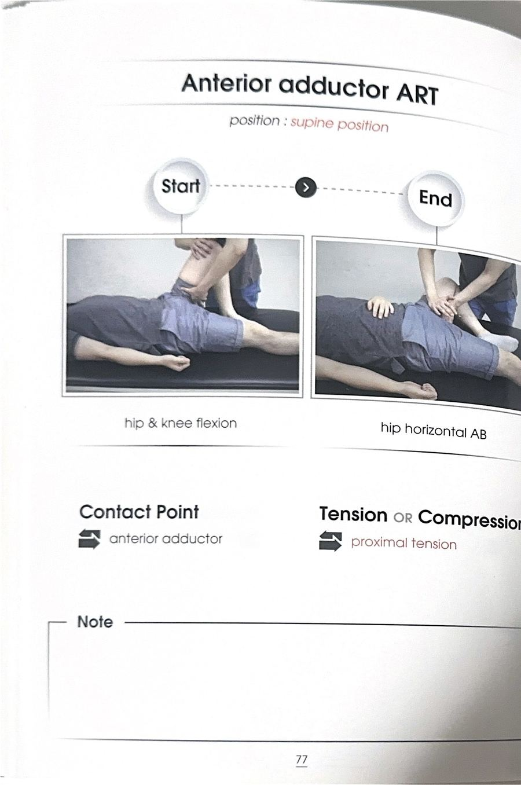

# 테크닉 43 | 치골근 / 두덩근 / Pectineus

## 이 사람에게 해!
- 다리가 안으로 모이거나 내회전 패턴을 보이는 사람 — 치골근은 안테리어(앞쪽) 내전근 그룹의 첫 번째 근육으로, 이 그룹이 뻣뻣해지면 고관절이 중립 위치에서 벗어나 내전+내회전+굴곡 방향으로 다리가 끌려갈 수 있다. 단, **강사 판단(1급 정보):** 이런 패턴을 "안테리어 어덕터가 세져서"로 단정하지 말고, 반대편(중둔근·대둔근 등 벌림·신전 주동근)의 약화·저활성 쪽에 무게를 두고 접근하는 것이 실제 개선율이 더 높다는 것이 강사의 반복 강조.

## 핵심 한 줄
치골근은 위쪽 치골가지(슈피리어 퓨빅 라무스)에서 시작해 대퇴골 뒤쪽 거친선(리니아 아스페라) 상부에 붙는, 안테리어 어덕터 3형제(치골근·장내전근·단내전근) 중 가장 위쪽에 위치한 근육으로, 내전(AD)을 주동하며 굴곡·외회전에도 협력근으로 참여한다.

## 짧아지는 자세 vs 늘어나는 자세
- **짧아지는 자세:** 고관절 내전 + 굴곡 + 외회전 방향.
- **늘어나는 자세:** 고관절 벌림(외전) + 신전 + 내회전 방향. 세부 스트레칭 시연은 원문에 확인되지 않는다 — 지어내지 않고 이 정도만 남긴다.

## 촉진 (Palpation)
원문 전사에는 치골근 단독 촉진 시연이 확인되지 않는다 — 확인된 것은 부착부 설명(치골가지·거친선)뿐이며, 지어내지 않고 미기재로 남긴다.

## F3 참고 이미지 (소책자)
소책자 실측 확인(2026-07-19, `테크닉 소책자.pdf` 스캔본 물리 77~78페이지 기준). 원문 페이지 제목이 "Anterior adductor ART/MET"로, 특정 근육 하나가 아니라 안테리어 어덕터 그룹(치골근·장내전근·단내전근) 전체를 대상으로 한 기법이다 — 이 카드의 "임상 포인트"에도 이미 "안테리어 어덕터 3형제"로 명시돼 있어, 세 카드(장내전근/단내전근/치골근)에 동일 이미지를 공유 반영한다. 사진 박스 안 손 위치·압력 방향과 Contact Point/Barrier·Resistance 필드도 그대로 보인다.

## 임상 포인트
| 포인트 | 내용 |
|---|---|
| 안테리어 어덕터 3형제 | 치골근(가장 위) → 장내전근(중간) → 단내전근(그 아래, 위쪽 거친선까지) 순서로 앞쪽에 위치 — 셋 다 기능이 AD(내전) 주동 + 굴곡·내회전 협력(치골근만 외회전 협력으로 원문에 다르게 언급됨, 아래 참고) |
| 기능 표기 차이 주의 | 원문에서 치골근은 "굴곡+외회전" 협력으로, 장내전근·단내전근은 "굴곡+내회전(IR)" 협력으로 서로 다르게 설명된다 — 강의 중 구어 오기 가능성이 있으나 원문 그대로 정직하게 구분 기재(추가 검증 필요 시 원문 재확인) |
| 이름의 유래 | "펙티니스가 라틴어로 빗이라는 의미" — 치골근이라는 이름은 위쪽 치골(두덩뼈)의 가지(퓨빅 라무스)에 붙는다는 부착 위치에서 유래 |
| 내전근 그룹 공통 특징 | 골반 안정화(코어 근육과 협업), 약화저활성이 흔해 뻣뻣·과활성으로 이어지기 쉬움, 스트레칭보다 코펜하겐 내전근 운동 등 몸통 개입을 동반한 신장성 운동이 권장됨(상세는 `테크닉_대내전근.md` 참조) |
| MET/ART 시연 여부 | 원문 전사에는 치골근에 대한 개별 수기 ART/MET 시연이 확인되지 않는다 — 지어내지 않고 미기재로 남긴다 |

## 금기 · 주의
원문에 치골근 단독의 금기·주의사항은 확인되지 않는다 — 지어내지 않고 미기재로 남긴다.

## 한 줄 정리
> "안테리어 어덕터 3형제 중 가장 위쪽 — 치골가지에서 시작해 거친선 상부로 붙으며 내전을 주동한다."

## 체인 링크
- **의심근육→** 장내전근·단내전근(안테리어 어덕터 그룹, 원문 근거: "앞에서부터 세 가지 근육들이 안테리어 어덥터예요")
- **테크닉→** 미기재
- **재검사→** 고관절 벌림 패턴 검사

<!-- ok -->
