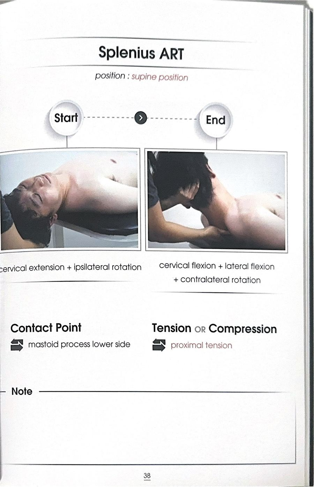
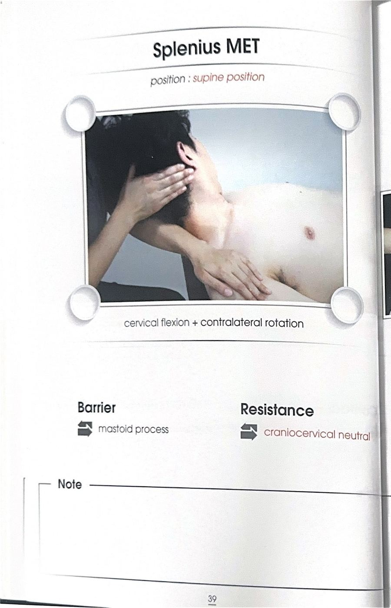

# 테크닉 17 | 판상근 / 널판근 / Splenius

## 이 사람에게 해!
- 구부정한 자세나 거북목 자세를 오래 취해 목보다 등(뒷목~윗등)이 아프다고 호소하는 사람 — **해부학적 이유:** 판상근은 등(흉추)에 넓게 부착돼 머리를 지지하는 근육이며, 거북목 자세에서는 앞쪽 SCM이 짧아지는 대신 판상근은 늘어나는(신장성) 스트레스를 계속 받는다. **원문 강조:** "여기(SCM)가 아픈 게 아니라 등이 아파요"라고 강사가 명확히 짚었다.
- 스마트폰을 오래 보는 사람 — 머리를 앞으로 꺾을수록 판상근이 지지해야 하는 하중이 커진다. **강사 판단(1급 정보):** 머리 무게(약 5~6kg)가 목이 꺾인 자세에서는 최대 약 20kg에 해당하는 부담으로 커지며, 그 부담을 판상근이 계속 짊어지게 된다.
- 목 커브(경추 전만)가 사라져 목이 일자가 된 사람 — 필라테스처럼 턱 당기기·목 늘리기(일롱게이션) 위주 운동만 오래 한 사람에게 특히 나타난다.

## 핵심 한 줄
판상근은 두판상근(머리로 가는 갈래)과 경판상근(목으로 가는 갈래) 두 부분으로 나뉘며, 등(흉추 극돌기)에서 시작해 유양돌기·후두골 또는 상부 경추 횡돌기까지 붙어 목의 신전과 회전을 담당하는 주동근이다.

## 짧아지는 자세 vs 늘어나는 자세
- **짧아지는 자세:** 목을 뒤로 젖히는(신전) 자세, 목을 회전시키는 방향과 같은 쪽
- **늘어나는 자세:** 거북목·구부정한 자세(목이 앞으로 나오고 등이 굽은 상태) — 이 늘어나는 스트레스가 판상근에 부담을 준다는 점이 이 근육의 핵심 임상 포인트

## 촉진 (Palpation)
전사문에는 판상근에 특화된 별도의 촉진 방법(랜드마크·손가락 위치 등)은 확인되지 않는다 — 지어내지 않고 미기재로 남긴다.

## ART 1
전사문에는 판상근에 대한 클리닉형 ART나 MET 시연은 확인되지 않는다. 확인되는 것은 아래의 목 커브 형성을 위한 신전 운동 원리 하나이며, 지어내지 않고 이를 "운동패턴 1"로 정리한다.

### 운동패턴 1 — 목 커브(전만) 형성을 위한 신전 자세 (내발기기 자세 등)
**원리:** 서 있거나 앉은 상태에서 목을 뒤로 젖히면 중력 때문에 앞쪽 근육들이 계속 저항하며 일하게 되어, 뒤쪽에 있는 판상근만 독립적으로 신전 운동을 시키기 어렵다.

**방법:**
① 엎드리거나 네발기기(내발기기) 자세, 또는 다이아몬드 프레스 자세처럼 머리가 아래를 향한 자세를 취한다.
② 그 상태에서 목을 드는(신전하는) 동작을 반복한다 — 이 자세에서는 뒤쪽에 있는 근육(판상근 포함)이 확실히 일하게 된다.

**강사 판단(1급 정보):** 목 커브(경추 전만)는 원래 아기가 배밀이·기기(터미타임)를 하며 고개를 드는 과정에서 형성되는 2차 만곡이다 — 그런데 턱 당기기·목 늘이기(일롱게이션) 동작만 계속하면 커브가 펴져서 "일자목"이 되어버린다. 강사는 이를 "숨은 키가 커진 게 아니라 목 커브를 펴서 만든 것"이라고 표현했다.

**재검사 확인:** 전사문에는 이 운동 직후의 별도 재검사 절차는 확인되지 않는다.

## F3 참고 이미지 (소책자)
소책자 실측 확인(2026-07-19, `테크닉 소책자.pdf` 스캔본 물리 38~39페이지 기준). 아래는 해당 물리 페이지를 좌/우 절반으로 크롭한 이미지 — 사진 박스 안 손 위치·압력 방향과 함께 Contact Point/Tension·Compression(또는 Barrier/Resistance) 필드도 그대로 보인다.

## 임상 포인트
| 포인트 | 내용 |
|---|---|
| SCM과의 줄다리기 | 거북목 자세에서 SCM(앞쪽)은 단축되는 반면 판상근(뒤쪽)은 신장성으로 스트레스를 받는다 — 원문 근거: "이 판상근이라고 하는 판상근은 신장 속에 이게 문제가 생기게 되겠죠 늘어나지 않을까요?" |
| 통증 위치의 착시 | 거북목 자세를 오래 취한 사람은 앞(SCM 부위)보다 뒤(등, 판상근 부위)가 아프다고 호소하는 경우가 많다 — 등 운동이 필요한 것은 맞지만, 판상근이 머리 무게(체감상 최대 20kg 수준)를 감당 못하고 있는 것이라는 점을 인지해야 한다 |
| 목 커브 형성의 핵심 | 목 커브(전만)를 만들려면 턱 당기기·늘이기 위주 운동만이 아니라, 엎드린 자세에서 목을 드는(신전) 운동이 필요하다 |
| 흉추와의 연관 | 목을 움직일 때 흉추 1~4번이 함께 움직인다고 강사가 언급 — 흉추가 굳으면 목도 함께 잘 못 움직이므로, 판상근 문제를 다룰 때 흉추 가동성도 함께 봐야 한다 |
| ART/MET 시연 여부 | 원문 전사문에는 판상근에 대한 클리닉형 ART나 MET(등척성수축) 시연은 확인되지 않는다 — 확인된 것은 위 신전 운동 원리뿐이며, 지어내지 않고 미기재로 남긴다 |

## 금기 · 주의
- 전사문에서 판상근에 특화된 금기·주의 사항은 별도로 언급되지 않는다.

## 한 줄 정리
> "거북목이면 앞(SCM)이 아니라 뒤(판상근)가 아프다 — 목 커브는 턱 당기기가 아니라 엎드려서 목을 드는 운동으로 만든다."

## 체인 링크
- **의심근육→** 흉쇄유돌근 (거북목 자세에서 SCM은 단축, 판상근은 늘어나는 줄다리기 관계)
- **테크닉→** 미기재
- **재검사→** 미기재 — 전사문에 이 근육에 특화된 재검사 절차가 확인되지 않음

<!-- ok -->
