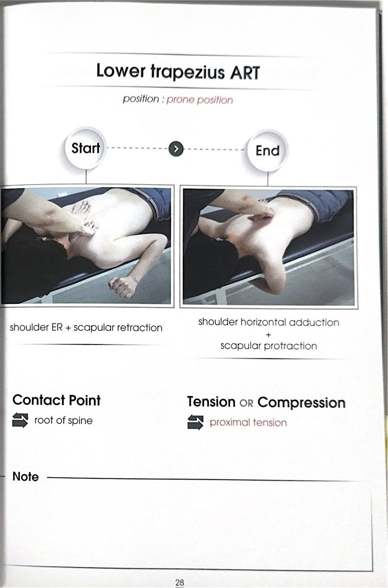

# 테크닉 10 | 하부승모근 / 아래등세모근 / Lower Trapezius

## 이 사람에게 해!
- 다운 스크래치 제한
- 팔 드는 동작 불편
- 상방회전 전체 기능 저하

## 핵심 한 줄
하부승모근 ART는 능형근 ART와 방법이 완전히 동일하다 — 위치만 다르다(능형근보다 더 아래쪽). 새로 배울 동작은 없고, 능형근에서 익힌 손기술을 위치만 옮겨서 그대로 적용한다.

## 짧아지는 자세 vs 늘어나는 자세
- **짧아지는 자세 / 리트랙션:** 견갑골을 모아놓은 자세
- **늘어나는 자세 / 프로트랙션:** 팔을 앞으로 뻗어 나무 껴안듯 멀리 보내는 자세

## 촉진 (Palpation)
원문에 별도 촉진(Palpation) 섹션 없음(미기재). 능형근 카드와 동일 개념으로 어깨뼈 가시 안쪽~12번 흉추 방향 사선 라인이 접촉 위치로 기술됨.

## ART 1
**자세:** 대상자 앉은 자세 또는 엎드린 자세 / 검사자 대상자 후방

**방법:**
① 능형근 ART와 방법 동일.
② 위치만 다름 — 어깨뼈 가시 안쪽에서 12번 흉추를 향해 사선으로 내려가는 방향(능형근보다 더 아래쪽).
③ 리트랙션(짧아진 자세)에서 시작.
④ 압박을 유지하면서 대상자 팔을 앞으로 뻗게 한다(프로트랙션 방향, 나무를 껴안듯 멀리).
⑤ 끝범위에서 압박을 잠깐 멈추지 말고 유지하다가, 다 뻗은 순간 척추 방향으로 살짝만 더 밀어준다.
⑥ 다시 리트랙션으로 돌아오기 → 반복(약 3회). 아픈 지점에서는 반복 횟수를 더 가져가도 된다.

**포인트:** 능형근보다 위치가 더 아래쪽이라는 것이 핵심 / 어깨뼈 가시 안쪽 ~ 12번 흉추 방향의 사선을 따라 수직으로 압박 / 프로트랙션 내내 압박하다가 끝범위에서만 척추뼈 방향으로 살짝 밀어주면 되고, 그 전에는 세게 밀지 않는다

## MET
없음 — 원문에 MET 섹션 없음(표에서도 MET 칸 "—")

## F3 참고 이미지 (소책자)
소책자 실측 확인(2026-07-19, `테크닉 소책자.pdf` 스캔본 물리 28페이지 기준). 아래는 해당 물리 페이지를 좌/우 절반으로 크롭한 이미지 — 사진 박스 안 손 위치·압력 방향과 함께 Contact Point/Tension·Compression(또는 Barrier/Resistance) 필드도 그대로 보인다.

## 임상 포인트
| 포인트 | 내용 |
|---|---|
| 순서 | 다운 스크래치 개선 흐름에서 상부승모근 다음으로 확인하는 근육 — 능형근과 방법이 같아 익히기 쉬움 |
| 목적 | 가동성 개선과 함께 하방회전 방해(팔 올리는 기능 보조) 목적으로도 사용 |
| 활성화 연결 | ART 이후 하부승모근 활성화 운동(엎드려 팔 들며 상방회전 보조 + 붙이기)으로 바로 연결 |
| 압통 부위 | 아픈 지점에서는 반복 횟수를 늘려도 무방 |

## 금기 · 주의
- 능형근보다 더 아래쪽(12번 흉추 방향)이라는 위치 차이를 반드시 확인 — 위치를 헷갈리면 능형근을 중복 시술하게 된다.
- 프로트랙션 내내 세게 미는 것이 아니라 끝범위에서만 살짝 밀어준다.

## 한 줄 정리
> "하부승모근 ART는 능형근과 방법이 완전히 동일 — 위치만 더 아래쪽(어깨뼈 가시 안쪽~12번 흉추 사선)으로 옮겨 적용"

## 체인 링크
- **의심근육→** 미기재 (원문에 특정 근육과의 연관 서술 없음)
- **테크닉→** 능형근 (원문: "능형근 ART랑 똑같거든요, 위치만 다릅니다")
- **재검사→** 다운 스크래치 테스트 — 검사_전체정리.md 검사 02

<!-- ok -->
