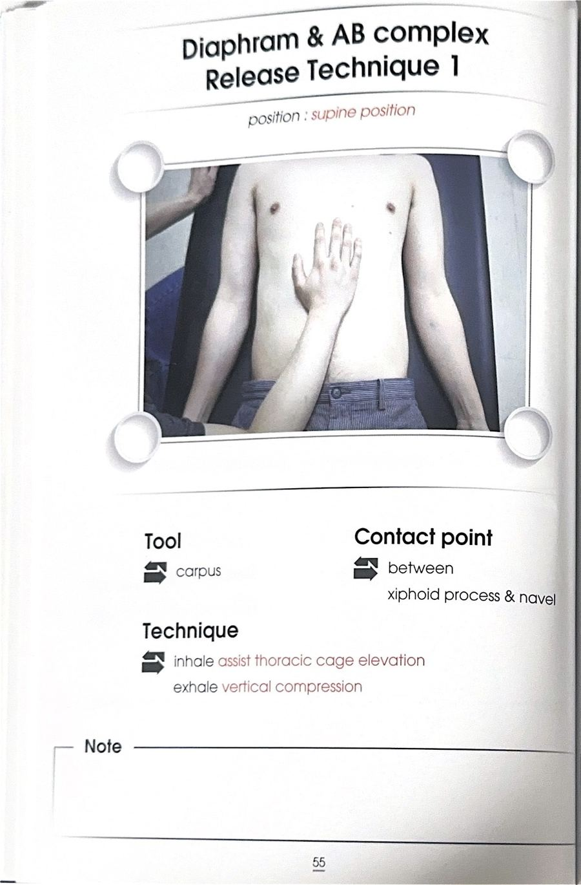
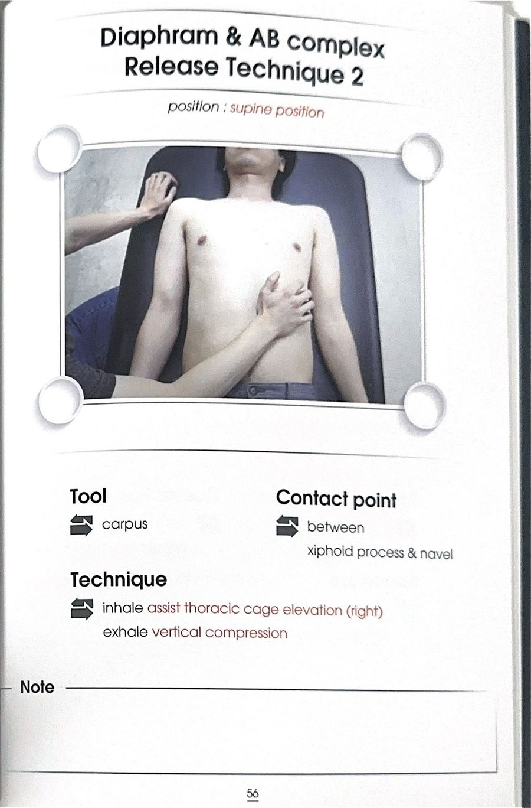
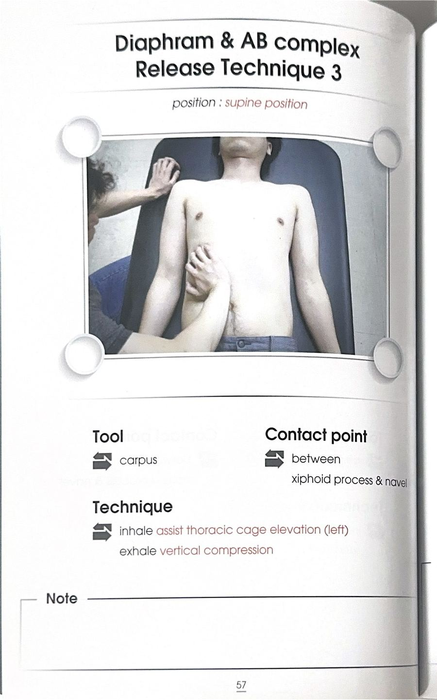

# 테크닉 31 | 횡격막 / 가로막 / Diaphragm

## 이 사람에게 해!
- 어깨를 들썩이며 숨을 쉬는(위로만 들썩이는) 사람 — 흉곽이 사방으로 확장되지 못하고 위아래로만 움직이는 안 좋은 호흡 패턴으로, 흉곽 가동성·요추 안정성 저하와 연결된다.
- 허리·골반·어깨가 동시에 여러 군데 아프다고 하는 사람 — **강사 판단(1급 정보):** 횡격막이 잘 못 내려오면 몸통 전체가 흔들려 어깨·목까지 통증이 번지는 경우가 많으므로, 다른 부위를 다 살피기 전에 호흡부터 우선 확인하는 게 효율적이다(원문: "호흡을 최우선으로 보셔야 돼요... 여기만 컨트롤 잘하면 좋아지는 경우가 되게 많아요").
- 필라테스처럼 배꼽을 당기는(드로인) 호흡만 학습해 일상생활에서도 계속 배를 조이고 있는 사람
- 배(복직근)가 뻣뻣해 속이 더부룩하다고 말하는 사람 — 배가 뻣뻣하면 횡격막이 내려갈 공간 자체가 줄어든다.
- 노인 대상자 — 노화로 횡격막의 상하 운동이 떨어지는 경향이 있어 적절한 호흡 훈련이 도움이 된다.

## 핵심 한 줄
횡격막은 흉강과 복강을 나누는 돔(지붕) 모양의 근육으로, 수축하며 아래로 내려가 흉강 안의 공간(음압)을 만들어 공기를 들이마시게 하는 1차 호흡근이자, 하강하며 아래쪽 복강 내 압력(복강내압=IAP=복압)을 사방으로 밀어 만드는 이너코어박스의 "지휘자"다.

## 짧아지는 자세 vs 늘어나는 자세
원문에는 스트레칭 개념의 신장/단축 자세는 확인되지 않는다 — 미기재. 대신 확인되는 것은 "쉬는 상태(이완, 위로 볼록)"와 "수축 상태(하강, 흡기)"라는 호흡 사이클 상의 두 국면이다.

## 촉진 (Palpation)
원문에는 횡격막 자체를 손으로 촉진하는 시연은 확인되지 않는다 — 미기재. 다만 앞선 코어 도입부에서 대상자의 옆구리(뒷구리)를 넓게 감싸 쥐고, 그 상태로 호흡을 시켜 뒤쪽까지 압력이 차는지 확인하는 방법이 함께 다뤄졌다(자세한 절차는 테크닉_복횡근·테크닉_요방형근의 촉진/평가 항목과 공유되는 도입부 내용).

## 운동처방 (ART/MET 아님)
**기본 원리:** 횡격막이 수축해 아래로 하강하면, 그 힘으로 흉강 안의 부피가 커져 음압이 생기고 공기가 자연스럽게 폐로 들어온다(주사기 피스톤을 당기면 공기가 빨려 들어오는 것과 같은 원리). 동시에 아래쪽 복강 공간이 눌리면서 복압(IAP)이 앞·뒤·좌·우·아래로 사방으로 증가해야 정상이다.

**좋은 호흡의 기준:** 흡기 시 배가 앞으로만 나오는 게 아니라 옆구리·뒷구리(등 쪽)까지 사방으로 확장돼야 "복압 조절 성공"이며, 한쪽으로만(앞으로만, 혹은 위로만) 치우치면 "복압 조절 실패"로 본다.

**자가 확인 방법(구두 지시):**
① 양손 엄지로 자신의 뒷구리(허리 뒤 오목한 부분)를 넓게 감싼다.
② 그 상태로 숨을 들이마셔 뒤쪽까지 잘 차는지 느껴본다.
③ 한쪽 손을 떼어 서혜부(팬티라인)에 대고, 아랫배까지 차는지 확인한다.
④ 이때 인위적으로 힘을 주는 느낌이 아니라, 숨이 들어오면서 저절로 지그시 밀리는 느낌이어야 한다. 배가 나와 보이는 게 싫어 억지로 참으면 이 느낌이 잘 안 나며, 그런 사람은 배 앞쪽이 이미 뻣뻣해져 있는 상태로 해석한다.

**팔 들기와 연결한 확인:** 팔을 들어 느낌을 본 뒤, 뒷구리 부분을 감싸 압박을 유지한 채 다시 팔을 들어본다. 이때 더 편하고 부드럽게 움직여진다면, 어깨 문제처럼 보였던 증상이 실제로는 몸통(복압 조절) 문제였을 가능성을 시사한다.

**연령·상황별 조정:**
- 노인: 노화로 횡격막의 상하 운동이 떨어지는 경향이 있어 호흡 훈련이 유익하다.
- **임산부는 호흡 훈련을 하지 않는다.** 횡격막 중심 호흡을 강조해 강하게 하강시키면 복압이 증가해 태아에게 위험할 수 있다 — 그냥 편안하게, 숨을 참지 않고 자연스럽게 호흡하도록 안내한다.

## F3 참고 이미지 (소책자)
소책자 실측 확인(2026-07-19, `테크닉 소책자.pdf` 스캔본 물리 55~57페이지 기준). 아래는 해당 물리 페이지를 좌/우 절반으로 크롭한 이미지 — 사진 박스 안 손 위치·압력 방향과 함께 Contact Point/Tension·Compression(또는 Barrier/Resistance) 필드도 그대로 보인다.

## 임상 포인트
| 포인트 | 내용 |
|---|---|
| 부착 | 하부 늑골(갈비뼈) 안쪽 늑연골구, 검상돌기(칼돌기), 상부 요추 |
| 형태 | 돔(지붕) 형태 — 쉬는 상태에서는 위로 볼록, 수축(흡기)하면 아래로 하강 |
| 1차 호흡근 | 호흡의 주동근이자 1차 호흡근. 횡격막이 아래로 못 내려오면 흉쇄유돌근·상부승모근·소흉근 등 목·어깨 근육이 대신 흉곽을 위로 들어올려 호흡을 보조하게 됨(2차 호흡근 과사용) |
| 복압 생성의 지휘자 | 복횡근·골반기저근·다열근과 함께 이너코어박스를 이루며(뚜껑=횡격막, 바닥=골반기저근, 옆면=복횡근, 뒤쪽 끈=다열근), 그중에서도 복압을 생성·증가시키는 "지휘자" 역할로 명시됨. 나머지 세 근육은 "단원"으로 비유됨 |
| 요추 안정화 근육이기도 함 | 상부 요추에 직접 부착되기 때문에, 횡격막 자체도 허리를 지지하는 안정화 근육 중 하나다. 횡격막 기능이 떨어지면 그 문제가 근막으로 연결된 요방형근·대요근에도 함께 번져 요추 안정화 기능 전체가 떨어질 수 있다 |
| 부위별 안정성 확보 방식 비교 | 목은 주변 근육들(DNF, 후두하근, 사각근, 기립근 등)이 사방에서 안정성을 만들고, 등(흉추)은 흉곽(갈비뼈 구조) 자체가 뼈로 안정성을 만들며, 허리(요추)는 앞쪽에 직접 붙는 근육이 없어 복압으로 안정성을 만든다 — 이 복압 안정화 시스템의 지휘자가 횡격막이다 |
| 복압 조절 실패의 원인 | ① 배꼽을 습관적으로 당기는 습관(필라테스식 드로인 호흡을 일상에서도 계속하는 경우 포함), ② 꽉 끼는 청바지·복압벨트 등 조이는 옷·보조기의 상시 착용, ③ 흉곽을 조이는 운동 습관 — 모두 횡격막의 하강을 방해해 복압 생성을 막는다 |
| 드로인 vs 브레이싱 | 배꼽을 당겨놓고 운동하는 드로인(할로윈) 호흡은 허리 통증이 아주 심한 초기 대상자에게 적합하고, 어느 정도 움직임이 가능해지면 원통을 최대한 부풀린 상태에서 고정·조절하며 호흡하는 브레이싱 방식으로 전환해야 한다(테크닉_복횡근 카드와 공유되는 내용) |
| 내장 가동성과의 연결 | 횡격막이 오르내리며 내부 장기를 움직여주는데(내부장기 모빌리티 유도), 배가 뻣뻣하면(예: 복직근 과긴장) 이 움직임이 막혀 속이 더부룩해질 수 있다 |

## 금기 · 주의
- **임산부는 횡격막 중심의 강한 호흡 훈련을 하지 않는다** — 복압 증가로 태아에게 위험할 수 있어 편안한 자연 호흡만 안내한다.
- 배꼽을 당기는 드로인 호흡은 운동 중에만 사용하고, 일상생활에서는 사방으로 편안하게 확장되는 호흡으로 되돌아가야 한다 — 두 호흡법을 혼동해 일상에서도 계속 조이면 오히려 복압 조절에 실패한다.

## 한 줄 정리
> "가슴과 배를 나누는 돔 모양의 지휘자 — 아래로 내려가야 숨이 들어오고 복압이 사방으로 퍼진다. 목·어깨·허리 통증이 여러 군데 겹칠 때는 다른 곳보다 먼저 이 근육의 호흡부터 확인한다."

## 체인 링크
- **의심근육→** 복횡근·골반기저근·다열근(이너코어박스 구성근, 명시적 함께 언급) · 요방형근·장요근(근막 연결, 명시적 언급) · 복직근(과긴장 시 횡격막 하강 방해, 명시적 언급)
- **테크닉→** 미기재
- **재검사→** 미기재

<!-- ok -->
