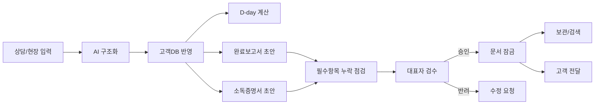
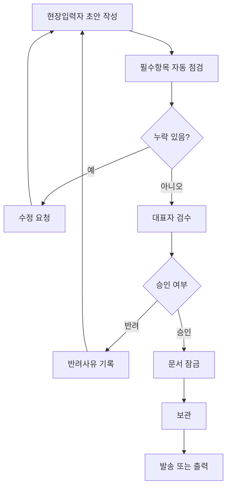

# 방역&클린 모바일 AI 운영관리 MVP 심층 리서치 수정 보고서

## 핵심 요약

이번 재검토의 핵심 결론은 간단합니다. 현재 사업계획서는 이미 **“방역업 현장 운영을 AI로 보조한다”**는 방향은 맞게 잡혀 있지만, 심사 관점에서는 여전히 **일반 업무자동화·간이 CRM**처럼 읽힐 위험이 있습니다. 따라서 문서의 중심축을 **오더메모 자동 정리**에서 끝내지 말고, **법정 문서 초안 생성 → 필수항목 누락 점검 → 대표자 승인 → 문서 잠금·보관**까지 이어지는 방역업 특화 운영 흐름으로 재정렬해야 합니다. 이때 모바일 현장 사용성은 **오프라인 임시저장, 사진 첨부, 승인/반려 로그, 권한 분리**가 있어야 현실성이 생깁니다.

다만, 이번 대화 런타임에서는 업로드된 PDF와 MD의 본문을 줄 단위로 안정적으로 직접 추출·인용하는 기능이 제한되어 있어, 아래의 비교·교체안은 **사용자가 명시한 MVP 범위**, **대화 내 이전 수정 메모**, 그리고 **현 사업계획서에 이미 들어 있다고 확인된 주요 기능 축**을 기준으로 재구성했습니다. 따라서 아래 문안은 **실제 신청서 원문에 그대로 붙여넣을 수 있도록 작성**했지만, 최종 제출 직전에는 원문 문단과 대조하여 제목·표현·예산 항목명 일치 여부를 한 번 더 확인하는 것이 안전합니다.

법·규정 측면에서는 방역·소독 관련 행정은 보건복지부와 질병관리청 체계 아래에서 운영되고, 개인정보 처리는 개인정보보호위원회가 총괄합니다. 따라서 MVP는 단순 생성형 AI 기능보다 **증빙관리·접근권한·보존·검수통제**를 먼저 설명하는 편이 더 설득력이 있습니다. citeturn40search0turn40search1turn38search0

## 사업계획서와 수정 메모의 차이와 문구 교체안

현재 문서와 수정 메모의 가장 큰 차이는 **서술의 무게중심**입니다. 기존 사업계획서는 “AI로 메모를 정리하고 문서를 초안 작성한다”는 업무효율 서사가 강하고, 수정 메모는 여기에 **방역업 고유의 법정 증빙성과 대표자 검수 구조**를 강하게 덧씌웁니다. 즉, 같은 MVP라도 심사위원에게는 “자동화 도구”보다 “방역업 운영관리 통제 도구”로 읽히도록 문장을 바꿔야 합니다.

아래 표는 원문이 이 대화에서 줄 단위로 직접 열리지 않는 한계를 감안해, **현재 신청서에 있을 가능성이 높은 기존 표현 유형**과 **바꿔 넣을 최종 문안**을 함께 정리한 것입니다. 실제 원문에서 유사 표현이 있으면 그대로 대체하면 됩니다.

### 바로 붙여넣기용 문구 교체표

| 교체 대상 섹션 | 현재 문서에서 흔히 보이는 표현 유형 | 문제점 | 최종 교체 문안 |
|---|---|---|---|
| 사업아이템 한줄 요약 | 방역업 고객관리와 문서작성 자동화 MVP | 일반 CRM처럼 보임 | **방역업 AI 운영관리 MVP** : 정기 고객사의 방문주기·방역이력·문서 요청 이력을 모바일 AI 입력 흐름으로 구조화하여 오더메모, 고객DB, 정기방문 D-day 리마인더, 완료보고서·소독증명서 초안 생성, 법정 필수항목 누락 점검, 대표자 승인 후 문서 잠금·보관, 만족도·불편사항 수집까지 하나의 업무 흐름으로 연결하는 방역업 전용 모바일 AI 운영관리 MVP를 구축함. |
| 지원동기 | 메모가 흩어져 있어 업무 비효율이 발생함 | “왜 지금 이 사업인가”가 약함 | 정기 고객사의 방문주기, 방역이력, 소독증명서 요청, 사후관리 내용이 휴대폰 메모·수기기록·개별 연락기록에 분산되어 있어 고객별 이력 확인과 후속 일정 관리에 반복 확인이 발생하고 있음. 특히 완료보고서·소독증명서는 현장 정보와 사용 약품, 요청 문서 여부를 다시 대조해야 하므로, 단순 문서작성보다 검수 부담이 큼. 따라서 AI가 전문 판단을 대체하는 것이 아니라 대표자가 확인한 현장 정보를 구조화하고 초안을 생성한 뒤, 대표자가 최종 승인하는 모바일 운영 흐름이 필요함. |
| AI 활용 아이템 소개 | 상담 메모를 정리해 보고서 초안 생성 | 특화성 부족 | 본 아이템은 정기고객 데이터와 현장 메모를 AI 입력 양식으로 구조화하여 오더메모, 고객DB, 정기방문 D-day 리마인더, 완료보고서·소독증명서 초안 작성, 법정 필수항목 누락 점검, 대표자 승인 후 문서 잠금·보관, 만족도·불편사항 수집을 하나의 모바일 업무 흐름으로 연결하는 방역업 전용 AI 운영관리 MVP임. 범용 CRM이나 단순 일정관리 솔루션이 아니라 방역이력, 사용 약품, 문서 요청, 사후관리 내역을 처음부터 하나의 운영 흐름으로 설계한 것이 차별점임. |
| AI활용 모델 구축 계획 | 입력 → 정리 → 초안 생성 | 검수·통제 구조가 없음 | 대표자 입력 또는 현장 입력 → AI 구조화 → 고객DB 반영 → D-day 산출 → 완료보고서·소독증명서 초안 생성 → 필수항목 누락 점검 → 대표자 검수·승인 → 문서 잠금·보관 순으로 운영함. 대표자 승인 전에는 문서 발송 및 최종 확정이 불가하도록 설계함. |
| AI 비즈니스 모델 개선 계획 | 고객관리 효율 상승 | 매출/운영 개선 구조가 흐림 | 기존의 현장 수행 후 필요 시 문서를 개별 작성하는 방식에서 벗어나, 고객별 방문주기·방역이력·사용 약품·문서 요청·만족도 데이터를 누적 관리하는 관리형 방역 서비스 구조로 전환함. 이를 통해 일정 누락과 재확인 부담을 줄이고, 문서 신뢰성을 높이며, 고객 반응 데이터를 사후관리와 재방문 상담 근거로 활용함. |
| 멘토링 활용 계획 | DB 설계, AI 도입 자문 | 무엇을 점검받는지 모호 | 멘토링에서는 방역업 실제 업무 흐름에 맞는 입력항목, 대표자 검수 기준, 문서 필수항목 누락 점검 방식, 개인정보 처리 기준, KPI 측정 구조를 구체화함. 특히 완료보고서·소독증명서 초안 템플릿, 승인/반려 기준, 문서 잠금·보관 기준, 실증 로그 관리 방식을 집중 점검함. |
| 사업화 자금 활용 | 앱 개발, 시스템 구축 | 외주 제작처럼 보일 위험 | 사업화 자금은 단순 앱 제작이 아니라 현장 실증형 모바일 AI 운영관리 MVP 구축에 사용함. 주요 항목은 현장 입력 흐름, 고객DB 구조화, D-day 리마인더, 문서 초안 생성, 필수항목 누락 점검, 승인·보관 흐름, 테스트·QA, 운영 매뉴얼 정리에 배분함. |
| 성과 목표 및 향후계획 | 작성시간 단축, 업무효율 향상 | 방역업 심사 포인트가 부족 | 정량 목표는 오더메모 작성시간 단축, 고객DB 등록률 향상, 일정 지연 감소, 완료보고서·소독증명서 초안 작성시간 단축, 대표자 승인 전 문서 발송 0건, 실증 30건 이상으로 설정함. 정성 목표는 고객별 방역이력·문서 이력·만족도 데이터의 누적 관리 체계를 확보하고, 이를 향후 재방문 상담 및 계약 유지 판단 근거로 활용하는 것임. |

### 심사에서 특히 바꿔야 할 표현

아래와 같은 표현은 가능한 한 줄이는 편이 안전합니다.

| 피해야 할 표현 | 이유 | 권장 대체 표현 |
|---|---|---|
| 자동 생성 | AI가 확정 권한까지 가진 것처럼 보임 | 초안 생성 |
| 자동 발송 | 개인정보·오발송 리스크를 암시 | 대표자 승인 후 발송 |
| 앱 제작 | 외주개발형 지원사업처럼 읽힘 | 현장실증형 모바일 AI 운영관리 MVP 구축 |
| 완전 자동화 | 법정문서·현장 업무 맥락상 과장 | 구조화·초안화·검수보조 |
| 고객관리 시스템 | 범용성만 강조됨 | 방역업 운영관리 흐름 |

### 성과지표 교체안

사업계획서의 KPI는 아래처럼 방역업 특화 지표를 추가해야 더 강해집니다.

| 지표 | 현재형 KPI에서 보완할 점 | 최종 KPI 문안 |
|---|---|---|
| 오더메모 작성시간 | 유지 가능 | 오더메모 작성시간 5분 → 1분 이내 |
| 문의정보 구조화 정확도 | 유지 가능 | 문의정보 구조화 정확도 85% 이상 |
| 고객DB 등록률 | 유지 가능 | 정기고객 DB 등록률 90% 이상 |
| 일정 누락 | 강화 필요 | 일정 지연·재확인 사례 월 2건 → 월 1건 이하 |
| 문서작성 시간 | 유지 가능 | 완료보고서·소독증명서 초안 작성시간 5분 → 3분 이내 |
| 검수통제 | 추가 필요 | 대표자 승인 없는 문서 발송 0건 |
| 법정항목 누락 | 추가 필요 | 필수항목 누락으로 인한 재작성 건수 0건 목표 |
| 고객반응 수집 | 추가 필요 | 만족도·불편사항 응답 30건 이상 확보 |

## 법·규정 관점 정리와 확인 필요 항목

방역·소독 관련 운영은 보건복지부와 질병관리청 체계에서 다뤄지고, 개인정보에 대한 일반법적 통제는 개인정보보호위원회가 맡고 있습니다. 따라서 MVP 설명에서 “법정 서류와 운영기록을 어떻게 보조하고 통제할 것인가”를 전면에 두는 방향은 정책 체계와도 맞물립니다. citeturn40search0turn40search1turn38search0

다만 이번 런타임에서는 국가법령정보센터와 지자체 원문 서식을 안정적으로 직접 열람하지 못해, **소독증명서/소독실시대장 별지서식의 조문·호·별지번호를 줄 단위로 최종 검증하지는 못했습니다**. 따라서 아래 표는 **이전 수정 메모에서 강조된 항목**, **현장 방역 문서 운용상 필수성이 높은 항목**, **일반적인 지자체 실무 관행**을 기준으로 정리한 **보수적 체크리스트**이며, 최종 배포 전에는 반드시 **국가법령정보센터 원문과 관할 보건소 서식**으로 재확인해야 합니다.

### 소독증명서와 소독실시대장 운영 체크리스트

| 구분 | MVP에 반드시 반영할 항목 | 현재 검증 상태 | 운영적 해석 |
|---|---|---|---|
| 소독 대상 정보 | 현장명, 주소, 공간유형 | 원문 재확인 필요 | 문서 식별과 현장 대조를 위해 필수 |
| 소독 일시 | 방문일, 시작·종료 또는 소독기간 | 원문 재확인 필요 | 날짜 누락 시 문서 신뢰성 저하 |
| 작업 내용 | 실시 내용 또는 주요 처리내역 | 원문 재확인 필요 | 완료보고서와 증명서 간 정합성 필요 |
| 사용 약품 | 약품명, 필요 시 희석/사용내역 | 원문 재확인 필요 | 방역업 특화성의 핵심 필드 |
| 수행 주체 | 업체명, 담당자 또는 확인자 | 원문 재확인 필요 | 대표자 승인 구조와 연결 |
| 확인 서명 | 대표자 또는 관리·운영자 확인 | 원문 재확인 필요 | “AI 초안”이 아니라 “대표 승인 문서”여야 함 |
| 보관 규칙 | 문서/대장 보존 | 수정 메모 기준 2년 보존 | 앱에는 잠금 상태와 보관일자 필드 필요 |
| 행정대장 | 소독실시대장 별도 기록 | 원문 재확인 필요 | 증명서와 대장 간 값 불일치 방지 필요 |

### 사업계획서에 넣을 법·규정 문장

아래 문장은 법률 자문처럼 단정하지 않으면서도 심사에 필요한 통제 개념을 분명하게 보여줍니다.

> 본 MVP는 방역업 문서 작성 자동화가 아니라, 현장 메모와 고객DB를 기반으로 완료보고서·소독증명서 초안을 생성하고 필수항목 누락 여부를 점검한 뒤 대표자 승인 후에만 문서를 잠금·보관하는 운영관리 구조를 구현하는 데 목적이 있음. 최종 증빙서류는 관계 법령 및 관할 보건소 안내 서식에 따라 대표자가 검토·확정함.

### 개인정보와 접근통제에 관한 보수적 운영 원칙

개인정보보호위원회가 한국의 개인정보 총괄 기관이라는 점을 고려하면, 모바일 MVP는 최소한 다음 운영원칙을 갖는 것이 안전합니다. citeturn38search0

| 원칙 | MVP 반영 방식 |
|---|---|
| 최소수집 | 고객명, 연락처, 현장주소, 문서요청 여부 등 운영 필수값만 수집 |
| 목적제한 | 일정관리·문서작성·사후관리 외 재사용 금지 |
| 접근권한 분리 | 현장입력자, 대표자, 관리자 권한을 분리 |
| 민감정보 축소 | 주민등록번호 등 과도한 식별정보는 수집 대상에서 제외 |
| 마스킹 | 외부 제출용 예시·테스트 데이터는 비식별화 |
| 감사기록 | 누가 언제 수정·승인·반려했는지 로그 유지 |

## 모바일에서 실현 가능한 MVP 기능 명세

이번 MVP는 “개발적으로 가능한가”보다 “현장에서 대표자가 실제로 쓸 수 있는가”가 더 중요합니다. 그러므로 기능 정의는 **정교한 스키마**보다 **업무 흐름 단위**로 잡는 편이 적절합니다. 정확한 테이블 구조, 키 체계, 버전 전략은 지금 단계에서는 **unspecified—require confirmation**으로 남겨두는 것이 맞습니다.

### 최소 기능 블록

| 기능 블록 | 핵심 목적 | 모바일 구현 수준 |
|---|---|---|
| 오더메모 입력 | 상담/현장 메모를 구조화 | 필수 |
| 고객DB | 고객·현장·주기·문서이력 누적 | 필수 |
| D-day 리마인더 | 정기방문 예정 관리 | 필수 |
| 완료보고서 초안 | 방문 결과 보고서 초안 생성 | 필수 |
| 소독증명서 초안 | 법정 문서형 초안 생성 | 필수 |
| 필수항목 누락 점검 | 누락 필드 경고 | 필수 |
| 대표자 승인/반려 | 최종 확정 통제 | 필수 |
| 문서 잠금·보관 | 승인 후 변경 통제와 보존 | 필수 |
| 만족도·불편사항 수집 | 사후관리 데이터 축적 | 필수 |
| 오프라인 임시저장 | 현장 통신 불안정 대응 | 권장 |
| 사진 첨부 | 현장 증빙 | 권장 |
| 감사로그 | 승인·수정 이력 추적 | 권장 |

### 화면 흐름



### 최소 필드 그룹

정확한 컬럼명과 데이터형은 **unspecified—require confirmation**으로 두되, 아래 그룹은 사실상 필요 최소치입니다.

| 필드 그룹 | 최소 항목 |
|---|---|
| 고객 기본 | 고객명, 연락처, 고객 구분, 문서 수신 희망 방식 |
| 현장 기본 | 현장명, 주소, 공간유형, 특이사항 |
| 정기관리 | 최근 방문일, 다음 방문 예정일, 주기, D-day |
| 작업 정보 | 작업일, 작업시간, 작업구역, 주요 처리내용 |
| 약품 정보 | 사용 약품명, 수량 또는 사용내역, 비고 |
| 문서 상태 | 완료보고서 필요 여부, 소독증명서 필요 여부, 초안 상태, 승인 상태 |
| 증빙 정보 | 사진 첨부 여부, 첨부 개수, 현장 메모 |
| 검수 정보 | 검수자, 승인일시, 반려사유, 잠금 여부 |
| 사후관리 | 만족도, 불편사항, 재방문 필요 여부 |

### UI 플로우

| 단계 | 사용자 행동 | 시스템 반응 |
|---|---|---|
| 상담 등록 | 고객명·현장·요청사항 입력 | 오더메모 초안 생성 |
| 현장 도착 | 방문 체크인·사진 첨부 | 현장 기록 임시저장 |
| 작업 완료 | 사용 약품·메모 입력 | 완료보고서/소독증명서 초안 생성 |
| 누락 점검 | 문서 발행 전 확인 | 누락 필드 경고 |
| 대표자 검수 | 승인 또는 반려 선택 | 승인 시 잠금, 반려 시 수정 요청 |
| 사후관리 | 만족도·불편사항 기록 | 고객DB에 누적 저장 |

### 오프라인, 사진 첨부, 승인, 감사기록

| 항목 | 권장 동작 | 이유 |
|---|---|---|
| 오프라인 저장 | 입력 즉시 로컬 임시저장, 네트워크 복구 시 동기화 | 방역 현장 통신 품질 편차 대응 |
| 충돌 처리 | 최신 수정본 자동 병합이 아니라 대표자 확인 트리거 | 문서 값 훼손 방지 |
| 사진 첨부 | 현장 사진은 작업 전/후 또는 핵심 구역 기준으로 첨부 | 보고 신뢰성 강화 |
| 승인 흐름 | 현장 입력자 승인 불가, 대표자만 최종 승인 | 검수 구조 명확화 |
| 반려 흐름 | 반려사유 필수 입력 | 재작업 추적 가능 |
| 잠금 | 승인된 문서는 수정 불가, 재발행 시 새 버전 생성 | 증빙 문서 통제 |
| 감사로그 | 작성·수정·승인·반려·잠금 이벤트 기록 | 추후 분쟁 대비 |

### 권한 모델

| 역할 | 가능한 작업 | 제한 |
|---|---|---|
| 현장입력자 | 상담/방문 입력, 사진 첨부, 초안 생성 요청 | 최종 승인·잠금 불가 |
| 대표자 | 전체 조회, 수정, 승인, 반려, 잠금, 재발행 | 없음 |
| 관리자 | 사용자관리, 기준값 관리, 보관 정책 관리 | 현장 기록 임의변경은 제한 권장 |

### 스키마 관련 유보 사항

아래 항목은 지금 임의 확정하면 안 됩니다.

| 항목 | 상태 |
|---|---|
| 고객/현장/방문을 분리한 3개 엔터티 구조 여부 | unspecified—require confirmation |
| 약품 마스터를 별도 테이블로 둘지 여부 | unspecified—require confirmation |
| 문서 버전과 재발행 이력 구조 | unspecified—require confirmation |
| 오프라인 동기화 충돌 정책 | unspecified—require confirmation |
| 만족도 점수 체계와 불편사항 카테고리 | unspecified—require confirmation |

## 검증 시나리오와 가상 데이터

### 시나리오 설계

#### 신규 견적 후 문서요청이 있는 첫 방문

소규모 카페가 바퀴 방역 문의를 남겼고, 대표자는 모바일에서 오더메모를 작성한다. 현장 방문 후 사용 약품과 주요 처리구역을 입력하니 완료보고서와 소독증명서 초안이 자동 생성된다. 대표자가 주소 누락 경고를 확인하고 값을 보완한 뒤 승인한다.

#### 정기고객 D-day 알림 기반 재방문

기존 정기고객의 다음 방문 예정일이 다가오자 D-day 알림이 발생한다. 현장입력자가 방문 결과만 보완하고 이전 이력과 약품 사용내역을 참고해 짧은 시간 안에 보고서 초안을 생성한다. 대표자는 승인 후 문서를 보관하고 문자 안내를 진행한다.

#### 현장 오프라인 입력 후 동기화

지하 현장이라 통신이 되지 않는 상태에서 현장입력자가 사진과 메모를 기록한다. 네트워크 복구 후 임시저장 데이터가 동기화되고, 대표자는 동기화 완료 이후에만 검수를 진행한다.

#### 고객 불편사항 발생 후 재방문 여부 판단

고객이 냄새 민원을 남긴다. 만족도 입력 화면에서 불편사항을 등록하고 재방문 필요 여부를 체크한다. 대표자는 기존 작업이력과 약품정보를 함께 보고 후속 안내 문구를 수정해 재발행 문서를 준비한다.

### 시나리오별 테스트 계획과 검증표

#### 신규 견적 후 문서요청이 있는 첫 방문

| 테스트 항목 | 기대 결과 | 검증 방법 |
|---|---|---|
| 오더메모 입력 | 고객·현장·요청사항이 구조화됨 | 입력 결과와 저장값 비교 |
| 문서 초안 생성 | 완료보고서·소독증명서 초안 생성 | 문서 생성 여부 확인 |
| 누락 점검 | 필수값 누락 시 경고 표시 | 주소 비워두고 경고 확인 |
| 대표자 승인 | 승인 전 발송 불가 | 승인 전 공유 버튼 비활성 확인 |
| 잠금 보관 | 승인 후 수정 제한 | 승인 후 수정 시도 로그 확인 |

#### 정기고객 D-day 알림 기반 재방문

| 테스트 항목 | 기대 결과 | 검증 방법 |
|---|---|---|
| D-day 계산 | 예정일 기준으로 D-day 정확 표시 | 예정일과 표시값 대조 |
| 기존 이력 호출 | 최근 방문·약품 이력 불러오기 | 고객 상세화면 확인 |
| 재방문 초안 생성 | 반복 입력 없이 초안 생성 | 평균 작성시간 기록 |
| 승인 로그 | 승인자·승인시간 기록 | 감사로그 확인 |

#### 현장 오프라인 입력 후 동기화

| 테스트 항목 | 기대 결과 | 검증 방법 |
|---|---|---|
| 오프라인 임시저장 | 통신 불가 상태에서도 저장 | 비행기모드 상태 재현 |
| 사진 유지 | 첨부 사진 손실 없음 | 동기화 후 파일 개수 확인 |
| 동기화 상태 표시 | 대기/완료 상태 구분 | 상태 배지 확인 |
| 검수 차단 | 동기화 전 승인 불가 | 대표자 화면 권한 테스트 |

#### 고객 불편사항 발생 후 재방문 여부 판단

| 테스트 항목 | 기대 결과 | 검증 방법 |
|---|---|---|
| 만족도 입력 | 점수·불편사항 저장 | 저장 후 DB 반영 확인 |
| 재방문 필요 체크 | 후속조치 큐 생성 | 후속관리 목록 확인 |
| 반려 후 수정 | 대표자 반려사유 노출 | 반려내역 확인 |
| 재발행 관리 | 재발행 시 새 버전 생성 | 문서 버전 비교 |

### 테스트용 가상 데이터

아래 데이터는 실제 고객정보가 아닌 합성 데이터입니다.

| 고객명 | 현장명 | 방문일 | 사용 약품 | D-day | 문서 요청 | 사진 첨부 | 승인 상태 | 만족도 |
|---|---|---|---|---:|---|---|---|---|
| 해오름카페 | 해오름카페 본점 | 2026-07-02 | 델타린 수화제 | -5 | 완료보고서+소독증명서 | Y | 승인 | 5 |
| 청솔유치원 | 청솔유치원 1층 교실동 | 2026-07-05 | 피레스로이드계 연무제 | -2 | 완료보고서 | Y | 승인 | 4 |
| 한빛약국 | 한빛약국 매장 | 2026-07-06 | 겔형 살충제 | -1 | 소독증명서 | N | 승인대기 | 5 |
| 수림오피스텔 | 수림오피스텔 지하주차장 | 2026-07-07 | ULV 연무제 | 0 | 완료보고서+소독증명서 | Y | 초안 | 4 |
| 오복식당 | 오복식당 주방 | 2026-07-08 | 분무형 살균소독제 | 1 | 완료보고서 | Y | 반려 | 3 |
| 새롬학원 | 새롬학원 상담실 | 2026-07-09 | 겔형 살충제 | 2 | 소독증명서 | N | 승인대기 | 4 |
| 더맑은의원 | 더맑은의원 대기실 | 2026-07-10 | 표면소독제 | 3 | 완료보고서+소독증명서 | Y | 초안 | 5 |
| 리버뷰호텔 | 리버뷰호텔 객실층 | 2026-07-11 | 분말형 살충제 | 4 | 완료보고서 | Y | 초안 | 4 |
| 행복마트 | 행복마트 창고 | 2026-07-12 | 연막소독제 | 5 | 소독증명서 | N | 승인대기 | 4 |
| 푸른요양원 | 푸른요양원 공용공간 | 2026-07-13 | 표면소독제+연무제 | 6 | 완료보고서+소독증명서 | Y | 초안 | 5 |
| 미소피트니스 | 미소피트니스 탈의실 | 2026-07-14 | 겔형 살충제 | 7 | 완료보고서 | N | 초안 | 4 |
| 은하문구 | 은하문구 매장 및 창고 | 2026-07-15 | 분사형 살충제 | 8 | 소독증명서 | Y | 초안 | 5 |

## 문서 초안 템플릿과 운영 문서

### 완료보고서 초안 템플릿

```markdown
# 완료보고서 초안

문서번호: [자동부여 또는 수기입력]
작성상태: 초안 / 승인대기 / 승인 / 반려
문서버전: v[ ]
대표자 승인 전 외부 발송 금지

## 고객 및 현장 정보
- 고객명:
- 현장명:
- 현장주소:
- 방문일:
- 작업시간:
- 담당자:
- 연락처:

## 작업 개요
- 작업 목적:
- 공간 유형:
- 주요 이슈:
- 요청사항:

## 작업 내용
- 처리 구역:
- 주요 작업 내용:
- 사용 약품:
- 비고:

## 현장 사진
- 사진 첨부 여부:
- 첨부 파일 수:
- 사진 설명:

## 후속 안내
- 고객 안내사항:
- 재방문 필요 여부:
- 다음 방문 예정일:
- 만족도:
- 불편사항:

## 검수 및 승인
- 초안 작성자:
- 작성일시:
- 검수 의견:
- 대표자 승인 여부:
- 승인일시:
- 승인 후 문서 잠금 여부:
```

### 소독증명서 초안 템플릿

```markdown
# 소독증명서 초안

문서번호: [자동부여 또는 수기입력]
작성상태: 초안 / 승인대기 / 승인 / 반려
문서버전: v[ ]
대표자 승인 전 증명서 효력 없음

## 기본 정보
- 고객명:
- 현장명:
- 현장주소:
- 공간 유형:
- 소독일자 또는 소독기간:

## 소독 실시 내용
- 주요 소독 구역:
- 소독 목적:
- 작업 개요:
- 사용 약품명:
- 사용 내역 또는 비고:

## 확인 사항
- 현장 특이사항:
- 필수항목 누락 점검 결과:
- 문서 재확인 필요 항목:

## 발급 정보
- 업체명: 방역&클린
- 담당자:
- 대표자:
- 승인일시:
- 문서 잠금 여부:
- 보관 위치 또는 보관키:

본 문서는 현장 입력자료를 바탕으로 생성된 초안이며, 대표자 승인 후 최종본으로 확정됨.
```

### 승인 워크플로우



### HANDOFF.md 초안

```markdown
# HANDOFF.md

## 목적
방역&클린 모바일 AI 운영관리 MVP의 범위, 핵심 기능, 검수 구조, 테스트 자산을 다음 작업자에게 인계한다.

## MVP 범위
- 오더메모
- 고객DB
- 정기방문 D-day 리마인더
- 완료보고서 초안
- 소독증명서 초안
- 필수항목 누락 점검
- 대표자 승인 → 문서 잠금·보관
- 만족도·불편사항 수집

## 이번 인계 산출물
- 사업계획서 문구 교체안
- 모바일 기능 명세
- 시나리오 4종
- 검증표 4종
- 합성 테스트 데이터 12건
- 문서 템플릿 2종
- 비개발자용 실행방법 초안

## 운영상 주의사항
- AI는 초안 생성과 구조화만 담당한다.
- 대표자 승인 전 문서는 외부 발송 금지다.
- 법정 서식 최종 확정은 관계 법령 및 관할 보건소 서식 재확인 후 진행한다.
- 스키마 구조 변경은 임의 확정하지 않는다.

## 미확정 항목
- 고객/현장/방문 엔터티 분리 방식
- 문서 버전 관리 방식
- 동기화 충돌 처리 방식
- 약품 마스터 구조
```

### 비개발자용 실행방법.md 초안

```markdown
# 비개발자용 실행방법.md

## 준비
1. 고객 기본정보와 현장정보를 먼저 등록한다.
2. 정기고객은 최근 방문일과 다음 방문 예정일을 입력한다.
3. 문서 요청 여부를 고객별로 체크한다.

## 현장 입력
1. 방문 전 오더메모를 확인한다.
2. 현장에서 작업 내용과 사용 약품을 입력한다.
3. 사진이 필요하면 작업 전/후 사진을 첨부한다.
4. 네트워크가 불안정하면 저장 후 나중에 동기화한다.

## 문서 초안 생성
1. 완료 후 ‘초안 생성’을 누른다.
2. 완료보고서 또는 소독증명서 초안을 확인한다.
3. 누락 경고가 뜨면 필드를 보완한다.

## 대표자 검수
1. 대표자가 초안을 열어 내용과 문구를 확인한다.
2. 이상이 없으면 승인한다.
3. 수정이 필요하면 반려사유를 적고 반려한다.

## 보관과 사후관리
1. 승인된 문서는 잠금 상태로 보관한다.
2. 고객 만족도와 불편사항을 등록한다.
3. 재방문이 필요하면 다음 일정으로 연결한다.
```

### 요약 HANDOFF 표

| 산출물 | 담당 역할 | 형식 | 수용 기준 |
|---|---|---|---|
| 사업계획서 문구 교체안 | 기획/대표 | 텍스트 | 신청서 본문에 복붙 가능 |
| 법·규정 체크리스트 | 대표/행정 | 표 | 최종 제출 전 원문 재확인 포인트 명시 |
| 모바일 기능 명세 | 기획/운영 | 표 | 기능 범위와 권한 흐름이 명확 |
| 시나리오 4종 | 기획/QA | 문서 | 각 시나리오별 입력-결과 흐름 존재 |
| 검증표 4종 | QA/대표 | 표 | 기대 결과와 검증 방법이 명시 |
| 합성 데이터 12건 | QA | 표 | 테스트에 바로 사용 가능 |
| 완료보고서 템플릿 | 운영/대표 | 문서 | 승인 필드 포함 |
| 소독증명서 템플릿 | 운영/대표 | 문서 | 승인·잠금 필드 포함 |
| HANDOFF.md | PM/대표 | Markdown | 다음 작업자가 범위 이해 가능 |
| 비개발자용 실행방법.md | 운영 | Markdown | 현장 사용자 기준 단계별 실행 가능 |

## 최종 판단과 다음 수정 우선순위

이번 수정안의 방향은 맞습니다. 특히 심사 문서에서는 **AI 성능**보다 **현장 운영 통제력**이 더 중요합니다. 그래서 본 계획서는 “메모 자동정리”보다 **방역업 운영관리**, “문서 자동생성”보다 **초안 생성과 대표 승인**, “일정 알림”보다 **정기고객 유지관리**, “데이터 축적”보다 **문서 보관과 사후관리 근거**가 앞에 나와야 합니다.

가장 먼저 반영할 우선순위는 세 가지입니다. 첫째, 본문 전체 용어를 **초안 생성 / 대표자 승인 / 문서 잠금·보관** 체계로 통일합니다. 둘째, KPI에 **승인 전 발송 0건, 필수항목 누락 재작성 최소화, 만족도 수집 건수**를 추가합니다. 셋째, 모바일 기능 설명에 **오프라인 임시저장, 사진 첨부, 반려사유, 감사로그**를 넣어 현장 실행 가능성을 분명히 합니다. 이 세 가지만 정리되어도 사업계획서는 일반 AI 자동화 지원서보다 훨씬 **방역업 특화형 운영관리 MVP**로 읽히게 됩니다.

법정 서식의 정확한 별지번호, 필수 기재항목 문언, 보존기간의 조문 표현은 최종 제출 전 반드시 **국가법령정보센터 원문과 관할 보건소 안내**로 확인해야 합니다. 이번 보고서에서는 그 부분을 임의 확정하지 않고 **확인 필요 항목**으로 남겼습니다. 그 보수적 태도 자체가 오히려 현재 단계의 기획 문서에는 적절합니다. 방역·소독 행정은 보건복지부와 질병관리청 체계와 맞물리고, 개인정보 처리는 개인정보보호위원회가 총괄하기 때문에, 최종 버전은 이 두 축을 기준으로 검수하면 됩니다. citeturn40search0turn40search1turn38search0

## 관련 문서

- [[1. Projects/클로드 방역 ai/법정요구사항_대조표_2026-07-07|법정요구사항_대조표_2026-07-07]]
- [[1. Projects/클로드 방역 ai/설계메모_권한과오프라인정책|설계메모_권한과오프라인정책]]
- [[1. Projects/클로드 방역 ai/3단계_12건테스트_결과요약|3단계_12건테스트_결과요약]]
- [[1. Projects/클로드 방역 ai/SKILL|SKILL]]
- [[1. Projects/클로드 방역 ai/최종요약보고서_2026-07-07|최종요약보고서_2026-07-07]]

<!-- ok -->
